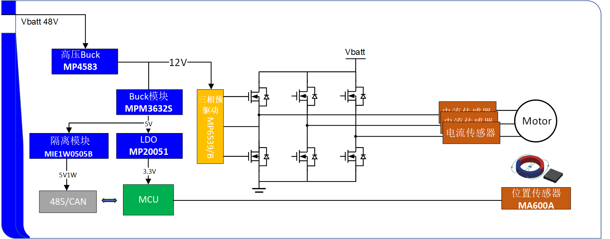
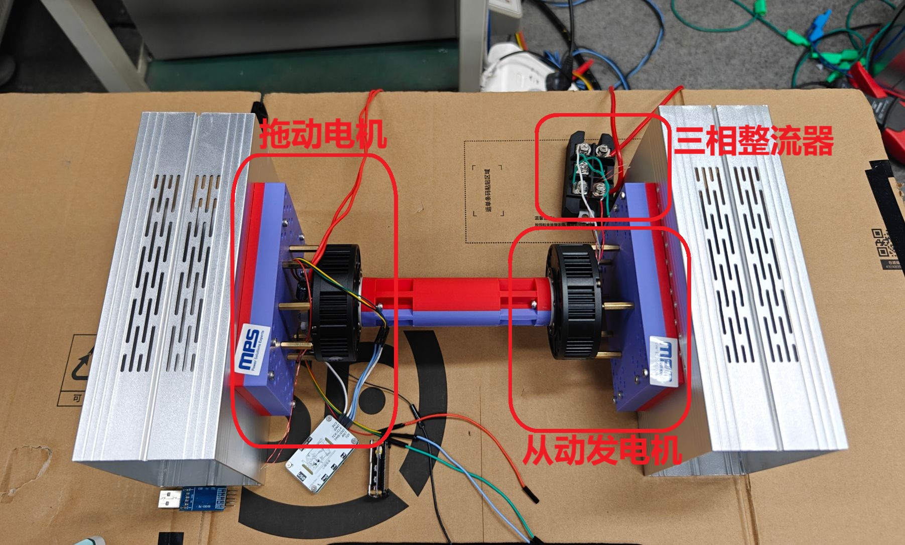
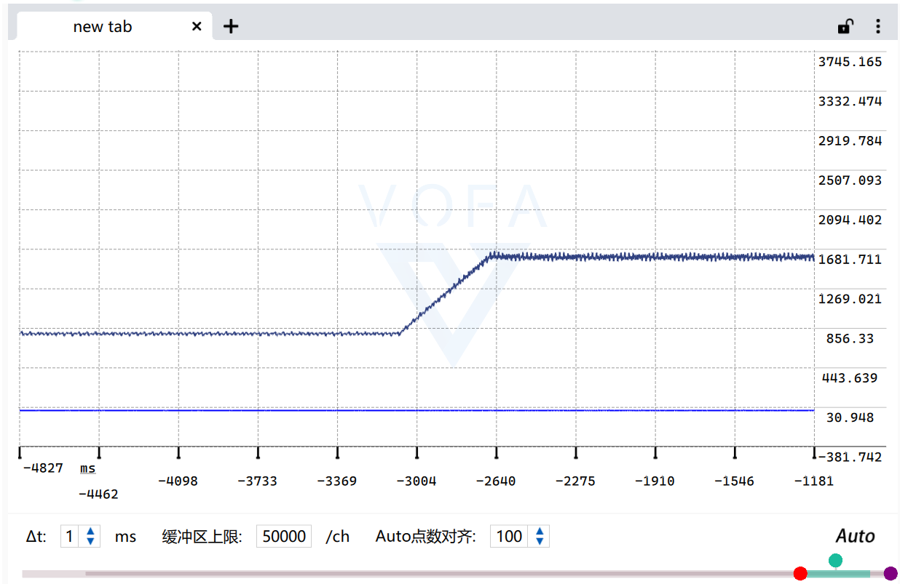
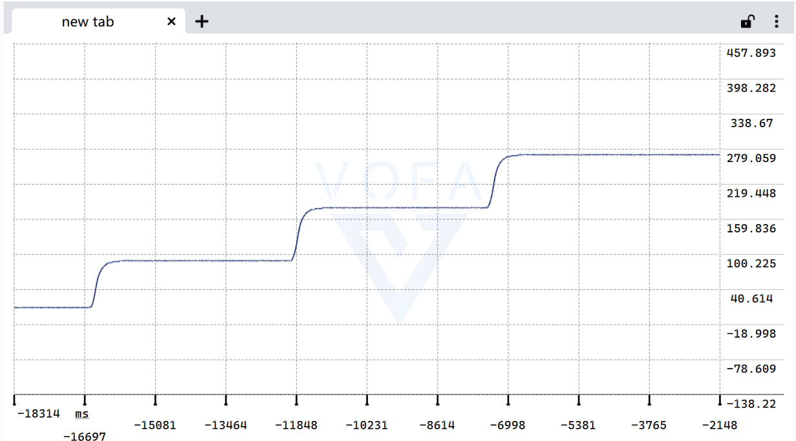
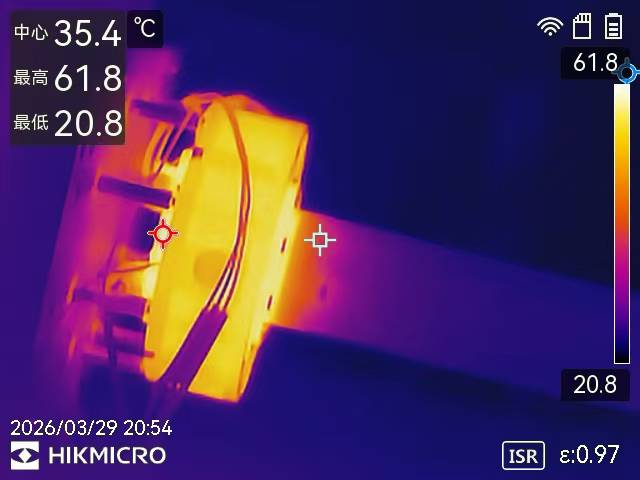
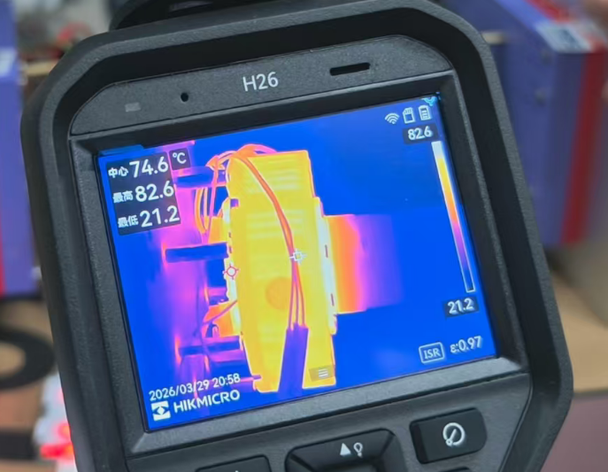
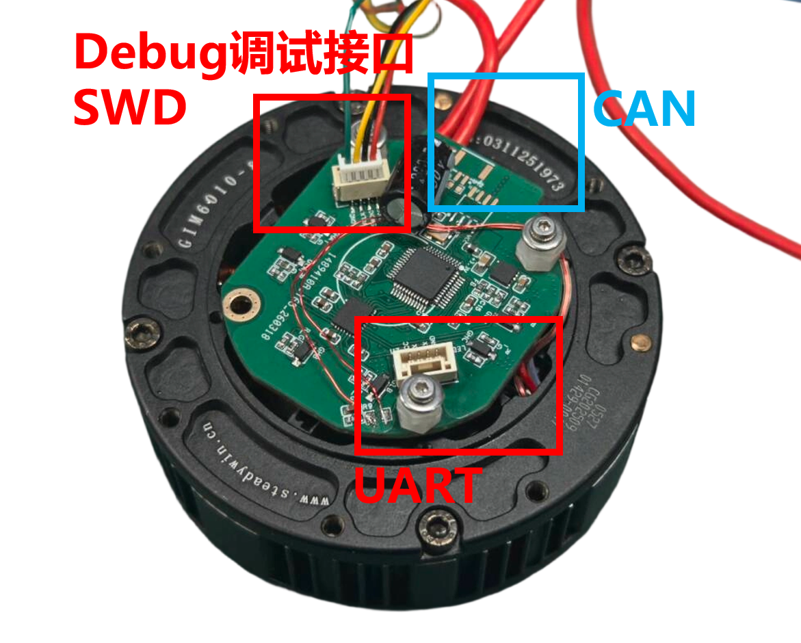

<div align="center">

# MPS-FOC STM32G431

### 开源无刷电机 FOC 控制工程 | Open-Source PMSM / BLDC FOC Project

<p>
  
  
  
  
  
</p>

</div>

## 目录

- [1. 项目简介](#sec-1-overview)
- [2. MPS大学计划](#sec-2-mps)
- [3. 硬件说明](#sec-3-hardware)
- [4. 验收测试与视频](#sec-4-test)
- [5. 软件架构](#sec-5-software)
- [6. 接口说明](#sec-6-interface)
- [7. 控制实现说明](#sec-7-control)
- [8. 快速开始](#sec-8-quickstart)
- [9. 项目目录](#sec-9-tree)
- [10. 已知限制与后续计划](#sec-10-plan)
- [11. 相关文件](#sec-11-files)
- [12. 许可证说明](#sec-12-license)

---

<a id="sec-1-overview"></a>

## 1. 项目简介

### 1.1 项目定位

本项目基于 `STM32G431CBT6`，面向 `PMSM / BLDC` 的三相 FOC 控制。仓库目标是提供一套可直接落到板级 bring-up 的开源实现。

适用场景：

- 板子已经打样完成，需要尽快确认“代码怎么烧录、上电后怎么先转起来”。
- 正在做自研 FOC 控制板，需要参考一套完整的“采样 -> 快环 -> 慢环 -> telemetry -> 调参”工程结构。

### 1.2 当前工程状态

当前仓库已经具备完整主链路，不是只有框架：

- 当前工程实现了 MPS-FOC 比赛中的全部测试项目；当前开源内容对应 LCEDA 开源广场中的 **V1.2 版本**（<mark>一定注意！！！</mark>），仅 **V1.2 版本** 为 STM32G431 实现。

### 1.3 适配电机型号

本项目当前默认机械与电机参数按 `GIM6010-8` 级别关节电机配置。以下关键值摘自 [`docs/GIM6010-8电机必要参数表.xlsx`](docs/GIM6010-8电机必要参数表.xlsx)。

| 必要参数 | 参考值     | 单位    | 本项目中的用途 / 需要同步的位置                                                                   |
| ---- | ------- | ----- | ----------------------------------------------------------------------------------- |
| 额定电压 | `48`    | V     | 对应当前 `48V` 母线平台与测试条件                                                                |
| 电压范围 | `12~48` | V     | 上电和带载测试需保证工作在该范围内                                                                   |
| 额定功率 | `158.4` | W     | 用于估算连续输出能力与热设计边界                                                                    |
| 额定扭矩 | `26.2`  | N.m   | 用于评估减速后输出能力与负载目标                                                                    |
| 额定电流 | `3.3`   | A     | 长时连续电流参考，不等同于当前调试用 `iq_limit` 上限                                                    |
| 相间电阻 | `0.443` | Ω     | 电流环对象参数，换电机后应重新核对 `current_kp/current_ki`                                           |
| 相间电感 | `0.222` | mH    | 影响电流环带宽和 PI 设计，需与 `program_init()` 同步                                               |
| 转速常数 | `1.98`  | rpm/V | 用于核对空载速度与反电势等级                                                                      |
| 扭矩常数 | `4.7`   | N.m/A | 用于估算输出扭矩与限流策略                                                                       |
| 极对数  | `14`    | 对     | 对应 [`program/App/motor_params.h`](program/App/motor_params.h) 中的 `MOTOR_POLE_PAIRS` |
| 减速比  | `8`     | 比     | 当前关节总成按 `8:1` 配置，对应 `MOTOR_GEAR_RATIO`                                              |

适配其他电机前，至少需要同步检查 [`program/App/motor_params.h`](program/App/motor_params.h) 中的 `MOTOR_POLE_PAIRS`、`MOTOR_GEAR_RATIO`、`MOTOR_ENCODER_ON_OUTPUT_SHAFT`、`MOTOR_ENCODER_DIRECTION_SIGN`；如果 `R/L/Kt` 与上表不同，还需要重新核对 [`program/App/program.c`](program/App/program.c) 里的电流环 PI 和 `iq_limit`。

---

<a id="sec-2-mps"></a>

## 2. MPS大学计划

### 2.1 申请说明

本项目基于MPS的比赛2025 MPS“智驱未来”机器人芯动力设计挑战赛，详细见：[2025 MPS“智驱未来”机器人芯动力设计挑战赛](https://docs.qq.com/doc/DY1BZckttV2ZQaEhj)

<p align="center">
    
</p>

MPS 中国大学计划面向高校教学、科研与竞赛项目，适合本项目所用电机控制相关器件申请。若需要 `MP6539B`、`MA600A`、`MIE1W0505`、`MP4583`、`MPM3632S`、`MP20051` 等样片，可通过对应入口申请。

- 在校大学生：使用 [MPS大学计划](https://www.monolithicpower.cn/cn/support/mps-cn-university.html)
- 非在校个人开发者：使用 [MPSNOW](https://www.monolithicpower.cn/cn/support/mps-now.html)
- 申请备注：`MPS-competition-FOC`

### 2.2 二维码入口

<p align="center">
  
</p>

---

<a id="sec-3-hardware"></a>

## 3. 硬件说明

### 3.1 硬件实物图


### 3.2 硬件核心配置

本节仅保留核心器件与板级功能分工；具体引脚、方向和信号关系统一放到第 `6` 章“接口说明”。

| 模块         | 当前实现            | 说明                       |
| ---------- | --------------- | ------------------------ |
| 主控 MCU     | `STM32G431CBT6` | 170 MHz，带高级定时器，适合 FOC 快环 |
| 位置反馈       | `MA600A`        | 16-bit 绝对值编码器，用于机械角度反馈   |
| 功率级预驱      | `MP6539B`       | 三相半桥预驱，负责功率级栅极驱动         |
| 主母线电源      | `MP4583`        | 宽输入 DCDC，支持当前 `48V` 母线平台 |
| 栅极驱动隔离供电   | `MIE1W0505`     | 为预驱动提供隔离电源               |
| `3.3V` POL | `MPM3632S`      | 为 MCU 和编码器供电             |
| 备份供电       | `MP20051`       | 为待机与辅助部分供电               |

### 3.3 编码器与机构默认配置

电机额定参数、极对数与减速比以 `1.3` 节为准；本节只保留与安装和方向相关、装配后最常需要核对的默认配置。当前参数位于 [`program/App/motor_params.h`](program/App/motor_params.h)：

| 参数      | 当前值  | 说明                                  |
| ------- | ---- | ----------------------------------- |
| 编码器方向   | `-1` | `MOTOR_ENCODER_DIRECTION_SIGN`      |
| 编码器安装位置 | 转子侧  | `MOTOR_ENCODER_ON_OUTPUT_SHAFT = 0` |

---

<a id="sec-4-test"></a>

## 4. 验收测试与视频

本节将仓库内已经公开的验收项、测试视频与现有数据集中整理，便于开源发布时快速核对。当前能够直接在仓库中举证的量化结果包括：

- `48V ±15%` 宽输入电压
- `60W` 等级稳定持续带载
- 速度环、位置环基础控制效果
- `180W` 对拖带载与温升热测结果

### 4.1 验收测试总表

测试视频可以再github仓库查看，也可以在B站直接查看：[STM32-MPS-FOC电机全流程测试_哔哩哔哩_bilibili](https://www.bilibili.com/video/BV1HWXkBHEVS/?spm_id_from=333.1387.homepage.video_card.click)

| #   | 验收项目       | 参考验收标准                                                                                                                                                                                              | 测试数据                                                       | 数据来源                                                |
| --- | ---------- | --------------------------------------------------------------------------------------------------------------------------------------------------------------------------------------------------- | ---------------------------------------------------------- | --------------------------------------------------- |
| 1   | 电源输入范围测试   | `48V ±15%` 宽输入电压                                                                                                                                                                                    | 40V-56V宽输入运行                                               | 视频：Test1 Power Supply  Input Voltage Range Test.mp4 |
| 2   | 启停性能测试     | 空载测试，目测电机启动是否丝滑无振动                                                                                                                                                                                  | 见视频运行结果                                                    | 视频：Test2 StartStop Performance.MP4                  |
| 3   | 速度控制精度测试   | 目标转速100RPM、200RPM, 通过MA600A寄存器读对应速度值                                                                                                                                                                | 测试报告记录：电机减速箱后出轴端 `100 rpm`下扰动`3rpm`、输出轴 `200 rpm` 下，`8rpm` | 视频：Test3 Speed Control Accuracy.MP4                 |
| 4   | 位置控制精度测试   | 目标角度90°、180°, 通过MA600A寄存器读对应角度值                                                                                                                                                                     | 几乎无误差                                                      | 视频：Test4 Position Control Accuracy                  |
| 5   | 负载输出能力测试   | 带载持续运行，可结合实际情况选择验证方式<br/>   1.通过10cm力臂实际带载2kg，验证可支持≥6A相电流<br/>   2. R+L模型模拟: 负载星型连接，每相取3Ω+200μH<br/>HSA=L, LSA=H；HSC=L, LSC=H<br/>HSB=20khz PWM 62% 占空比，LSB       与其互补； <br/>测量该条件下IOUTB或48V母线侧电流大小 | 当该项目等效功率60W等级。本仓库对于60W等级和180W等级分别进行了测试，详情可见下面说明。           | 视频：LoadTEST.MP4                                     |
| 6   | 负载输出能力补充测试 | 10cm力臂，2kg负载，48Vbus 265rpm下连续运行30分钟，测量电机NTC热敏电阻(10K 3950)对应阻值                                                                                                                                       | 同上                                                         | 视频：LoadTEST.MP4                                     |

### 4.2 测试平台

为验证持续带载能力，本项目搭建了双电机对拖测试平台：左侧电机作为驱动，右侧电机作为发电机，经过整流后接入电子负载或实验台架。右图中的测试设备只用到了Load与DC source。

| 测试平台总览                                        | 实验台架与测量设备                                    |
| --------------------------------------------- | -------------------------------------------- |
|  |  |
| 图 4-1. 双电机对拖测试平台，标出了驱动电机、发电机与整流链路。            | 图 4-2. 实验台架与测量设备，包含整流器、负载、示波器及交直流电源。         |

### 4.3 单项测试数据

#### 4.3.1 电源输入测试

详见视频

#### 4.3.2 启停性能测试

详见视频

#### 4.3.3 速度控制精度测试



如上图所示，为速度控制时的精度与扰动情况；图中数据为电机输出轴之前的机械转速 RPM。

#### 4.3.4 位置控制精度



如图所示，位置阶跃响应基本无静差，可作为位置控制精度验证结果。

#### 4.3.5 负载输出能力与热测量

负载输出测试可参考 `LoadTEST.MP4`。仓库中给出了 `180W` 持续带载运行示例，高于赛题要求的 `60W` 功率等级，可作为硬件热设计与连续输出能力的参考。

| 2 min 温升热像                                               | 8 min 温升热像                                             |
| -------------------------------------------------------- | ------------------------------------------------------ |
|               |             |
| 图 4-3. 连续带载 2 min 时的热成像，中心温度约 `35.4 °C`，最高温度约 `61.8 °C`。 | 图 4-4. 连续带载 8 min 时的热成像，壳温约 `74.6 °C`，最高热点约 `82.6 °C`。 |

运行 8 min 后，系统热点约提升至 `82.6 °C`，可作为当前 `180W` 工况下的温升参考。

---

<a id="sec-5-software"></a>

## 5. 软件架构

### 5.1 软件结构图

<p align="center">
  
</p>

### 5.2 控制流程图

<p align="center">
  
</p>

### 5.3 代码组织

| 📁 目录 / 文件                  | 🧠 职责                           |
| --------------------------- | ------------------------------- |
| `program/Core/`             | HAL 初始化、IRQ、CubeMX 生成外设配置       |
| `program/App/program.c`     | 当前真实控制主链路、快慢环调度、保护、telemetry    |
| `program/App/foc_core.c`    | Clarke / Park / 反 Park / SVPWM  |
| `program/App/ma600a.c`      | MA600A 绝对值编码器驱动                 |
| `program/App/filter.c`      | 一阶低通滤波器                         |
| `program/App/cli_uart.c`    | VOFA / DMA 串口发送                 |
| `program/App/drv_pid.c`     | 通用 Q15 PI 组件，当前不在 10 kHz 热路径主链里 |
| `program/App/motor_state.c` | 状态对象与保留状态机逻辑                    |
| `docs/`                     | 补充说明、调试文档、图像资源                  |

---

<a id="sec-6-interface"></a>

## 6. 接口说明

### 6.1 板级硬件接口

<p align="center">
  
</p>

以下接口定义以当前仓库 `V1.2` 硬件和 CubeMX 配置为准，主要来源于 [`program/Core/Src/tim.c`](program/Core/Src/tim.c)、[`program/Core/Src/adc.c`](program/Core/Src/adc.c)、[`program/Core/Src/spi.c`](program/Core/Src/spi.c)、[`program/Core/Src/usart.c`](program/Core/Src/usart.c) 与 [`program/Core/Src/gpio.c`](program/Core/Src/gpio.c)。

本节只说明板级接口和引脚映射；器件选型与供电分工见 `3.2` 节。

| 接口类别      | MCU / 外设                    | 引脚                              | 方向      | 当前约定                        |
| --------- | --------------------------- | ------------------------------- | ------- | --------------------------- |
| 三相 PWM 驱动 | `TIM1_CH1/2/3 + CH1N/2N/3N` | `PA8/PA9/PA10` + `PC13/PB0/PB1` | 输出      | 六路互补 PWM，接入 `MP6539B` 预驱    |
| 三相电流采样    | `ADC1_IN1 / IN3 / IN4`      | `PA0 / PA2 / PA3`               | 输入      | `IA / IB / IC` 注入组同步采样      |
| 母线电压采样    | `ADC2_IN12`                 | `PB2`                           | 输入      | `VBUS`，由 `ADC2 + DMA` 周期采样  |
| NTC 温度采样  | `ADC2_IN14`                 | `PB11`                          | 输入      | 电机或板级热敏电阻输入                 |
| 编码器接口     | `SPI1 + ENC_CS`             | `PA5 / PA6 / PA7` + `PA4`       | 双向      | 对接 `MA600A` 绝对值编码器          |
| 功率级使能     | `N_SLEEP`                   | `PB14`                          | 输出      | `1 = 使能`，`0 = 关断`           |
| 驱动故障输入    | `N_FAULT`                   | `PB15`                          | 输入      | 上拉输入，`0 = 故障有效`             |
| 调试串口      | `USART1`                    | `PB6 / PB7`                     | TX / RX | 默认 `115200 8N1`，当前主要用于上位机调试 |

### 6.2 通信与调试接口

| 接口                | 默认配置                                             | 当前用途                                                 |
| ----------------- | ------------------------------------------------ | ---------------------------------------------------- |
| `SPI1`            | 主机模式、`16-bit`、`CPOL=1`、`CPHA=2EDGE`、软 NSS、分频 `8` | 专用于 `MA600A` 角度读取，不建议与其他器件混挂                         |
| `USART1`          | `115200`、`8N1`、无流控、TX DMA                        | 当前输出 `VOFA JustFloat` 调试数据；`RX` 引脚已预留，但仓库暂未实现上位机命令协议 |
| `TIM6 + ADC2 DMA` | `1 kHz` 慢任务节拍                                    | 后台采样 `VBUS / NTC` 并驱动调试刷新                            |

当前对外稳定的程序访问入口主要有两个：

```c
motor_state_t *program_get_motor(void);
const volatile program_telemetry_t *program_get_telemetry(void);
```

其中 [`program_get_motor()`](program/App/program.h) 适合调试阶段直接改写控制命令，[`program_get_telemetry()`](program/App/program.h) 适合统一读取观测量。

### 6.3 软件写入接口

当前项目没有另外封装一层命令协议，调试和 bring-up 默认直接通过 `g_motor` 或 `program_get_motor()` 写入控制量。常用写入项如下：

| 写入变量                                     | 单位 / 取值 | 作用                               |
| ---------------------------------------- | ------- | -------------------------------- |
| `g_motor.run_request`                    | `0 / 1` | 总运行使能；置 `1` 后状态机才允许对齐、使能功率级并开始发波 |
| `g_motor.current_loop_enable`            | `0 / 1` | `0` 为开环电压模式，`1` 为电流环模式           |
| `g_motor.speed_loop_enable`              | `0 / 1` | `1` 时速度环接管转矩给定                   |
| `g_motor.position_loop_enable`           | `0 / 1` | `1` 时位置环输出速度参考，需同时开启速度环          |
| `g_motor.control_angle_open_loop_enable` | `0 / 1` | `1` 时改为开环生成电角度，不使用 `MA600A` 闭环角度 |
| `g_motor.ud_ref` / `g_motor.uq_ref`      | V       | 开环电压模式直接给定 `d/q` 轴电压             |
| `g_motor.speed_ref_mech_rpm`             | rpm     | 速度环目标机械转速                        |
| `g_motor.position_ref_mech_deg`          | deg     | 位置环目标机械角度；推荐作为唯一外部位置指令入口         |
| `g_motor.iq_limit`                       | A       | 电流 / 转矩限幅                        |
| `g_motor.speed_kp` / `g_motor.speed_ki`  | -       | 速度环参数                            |
| `g_motor.position_kp`                    | -       | 位置环比例参数                          |

### 6.4 软件观测接口

推荐统一从 `g_program_telemetry` 读取观测量，而不是在多个模块之间分散查找临时变量。常用观测量如下：

| 观测类别   | 典型字段                                                                            | 用途                |
| ------ | ------------------------------------------------------------------------------- | ----------------- |
| 原始采样   | `ia_raw` `ib_raw` `ic_raw` `vbus_raw` `ntc_raw`                                 | 检查 ADC 量程、零偏和采样链路 |
| 电流与角度  | `ia` `ib` `ic` `id` `iq` `theta_elec`                                           | 检查 FOC 变换与电流闭环状态  |
| 速度与位置  | `speed_meas_mech_rpm` `position_meas_mech_deg` `position_meas_mech_rad`         | 检查测速、位置环与编码器方向    |
| 控制命令镜像 | `speed_ref_mech_rpm` `position_ref_mech_deg` `iq_limit_a`                       | 核对外部给定是否正确进入控制链   |
| 运行状态   | `control_state` `power_stage_enabled` `driver_fault_active` `fast_loop_overrun` | 判断状态机、功率级和实时性是否正常 |

### 6.5 使用注意事项

- `g_motor.position_ref_mech_deg` 是当前项目建议的外部位置指令入口；`position_ref_mech_rad` 更适合看作程序内部换算后的只读镜像。
- `N_FAULT` 为低有效，驱动器报错时会直接进入故障处理并拉低功率级使能。
- `run_request` 建议最后置位；在修改模式位和参考值后再启动，可以减少上电瞬间的误动作。
- 当前仓库默认 `iq_limit = 12 A` 是比赛带载验证时的调试上限，不代表 `GIM6010-8` 的长期额定连续电流。
- 更换电机、减速比、编码器安装位置或方向后，除了改 [`program/App/motor_params.h`](program/App/motor_params.h)，还应重新核对 [`program/App/program.c`](program/App/program.c) 的环路参数和限幅设置。

---

<a id="sec-7-control"></a>

## 7. 控制实现说明

### 7.1 控制流程说明：从 ADC 采样到 PWM 输出

当前工程的实际控制链路如下：

1. `TIM1` 输出中心对齐 PWM，并通过 `TRGO2 = UPDATE` 触发 `ADC1 injected`。
2. `ADC1` 一次完成 `IA / IB / IC` 三路电流采样。
3. 在 `HAL_ADCEx_InjectedConvCpltCallback()` 中读取三相原始值。
4. 启动阶段累计 `1024` 个样本，得到每相零偏。
5. 同步调度 `MA600A` 读角，更新机械角、电角度和测速窗口。
6. 原始电流码值转换为安培值，并做一阶低通。
7. 执行 `Clarke / Park`，得到 `id / iq`。
8. 位置环按 `200 Hz` 分频运行，输出机械速度参考。
9. 速度环按测速窗口更新运行，输出 `iq_ref` 或 `uq_ref`。
10. 电流环按 `10 kHz` 运行，输出 `ud_ref / uq_ref`。
11. 反 `Park` 后进入 `SVPWM`。
12. 将 `duty_a / duty_b / duty_c` 写入 `TIM1->CCR1/2/3`。

### 7.2 中断结构 / 控制周期

快环入口调用链：

```text
ADC1_2_IRQHandler
  -> HAL_ADC_IRQHandler(&hadc1)
    -> HAL_ADCEx_InjectedConvCpltCallback()
      -> program_adc_injected_conv_cplt_callback()
```

慢环入口调用链：

```text
TIM6_DAC_IRQHandler
  -> HAL_TIM_IRQHandler(&htim6)
    -> HAL_TIM_PeriodElapsedCallback()
```

当前工程对应的运行频率：

| ⏱️ 项目    | 当前值         | 触发源 / 说明                                 |
| -------- | ----------- | ---------------------------------------- |
| PWM 载波   | 约 `20 kHz`  | `TIM1 center-aligned + ARR=4249 + RCR=3` |
| 电流环      | `10 kHz`    | `ADC1 injected` 完成回调                     |
| 位置环      | `200 Hz`    | 快环分频                                     |
| 速度测速窗口   | `20` 个快环样本  | `PROGRAM_SPEED_OBSERVER_WINDOW_SAMPLES`  |
| 速度环有效更新率 | 名义 `500 Hz` | 由测速窗口更新驱动                                |
| 慢任务节拍    | `1 kHz`     | `TIM6` 中断 + `TIM6 TRGO -> ADC2`          |

慢环主要处理：

- `ADC2 + DMA` 采集 `VBUS / NTC`
- `program_task()` 在 `while(1)` 中按 `TIM6` 节拍执行后台任务和遥测输出

<a id="sec-8-quickstart"></a>

## 8. 快速开始

此处重点关注变量g_motor,控制参数结构体

### 8.1 开发环境

- IDE：Keil / MDK
- 工程文件：[`program/MDK-ARM/STM32G431_FOC.uvprojx`](program/MDK-ARM/STM32G431_FOC.uvprojx)
- CubeMX 工程：[`program/STM32G431_FOC.ioc`](program/STM32G431_FOC.ioc)
- 下载方式：CMSIS-DAP Debugger

### 8.2 程序上电后自动完成的内容

- `ADC1 / ADC2` 校准
- `TIM1` PWM 启动并保持 `50%` 占空比
- 三相电流零偏累计
- `ADC2 DMA` 开始采集 `VBUS / NTC`
- `MA600A` 首次读角

### 8.3 第一次跑起来的推荐配置

建议第一次出力先不要直接上速度环，而是先做开环电压测试：

```c
g_motor.current_loop_enable = 0;
g_motor.speed_loop_enable = 0;
g_motor.position_loop_enable = 0;
g_motor.ud_ref = 0.0f;
g_motor.uq_ref = 0.5f;   /* 从小值开始 */
g_motor.run_request = 1;   /*  最核心的启动信号，启动这个才开始运行发波 */
```

程序会先自动做对齐，再进入基于编码器角度的手动电压模式。

### 8.4 模式控制说明

模式变量的完整定义见 `6.3 软件写入接口`。这里仅保留首次调试最常用的组合方式：

- 开环电压测试：`current_loop_enable = 0`，`speed_loop_enable = 0`，`position_loop_enable = 0`
- 电流环调试：`current_loop_enable = 1`，`speed_loop_enable = 0`，`position_loop_enable = 0`
- 速度环调试：`current_loop_enable = 1`，`speed_loop_enable = 1`，`position_loop_enable = 0`
- 位置环调试：`current_loop_enable = 1`，`speed_loop_enable = 1`，`position_loop_enable = 1`

位置外部给定建议直接写 `g_motor.position_ref_mech_deg`。

### 8.5 首次需要看的变量

| 👀 变量                  | 正常现象      |
| ---------------------- | --------- |
| `current_offset_ready` | 上电后置位     |
| `ia / ib / ic_meas`    | 静止时接近 `0` |
| `i_abc_sum`            | 接近 `0`    |
| `ma600a_angle_rad`     | 手动转动时连续变化 |
| `driver_fault_active`  | `0`       |
| `fast_loop_overrun`    | `0`       |

### 8.6 三环由内到外的闭环调试顺序

不要跳步，建议严格按“由内到外”执行：

| 阶段      | 🎯 目标  | 🔧 推荐配置           | 👀 重点观察                                          |
| ------- | ------ | ----------------- | ------------------------------------------------ |
| Stage 0 | 静态链路确认 | `run_request = 0` | `ia/ib/ic` `vbus` `ma600a_angle_rad`             |
| Stage 1 | 验证出力方向 | 关速度环、关位置环         | `uq_ref` `theta_elec`                            |
| Stage 2 | 调电流环   | 开电流环，关外环          | `id` `iq` `ud_ref_cmd` `uq_ref_cmd`              |
| Stage 3 | 调速度环   | 开速度环，位置环保持关闭      | `speed_ref_mech_rpm` `speed_meas_mech_rpm`       |
| Stage 4 | 调位置环   | 最后再开位置环           | `position_ref_mech_deg` `position_meas_mech_deg` |

### 8.7 当前运行默认参数

以下为当前主路径实际生效的默认参数，来源于 [`program/App/program.c`](program/App/program.c)：

电流环带宽计算，可以看代码注释，当前电流环带宽为1Khz。

| 🧪 参数         | 当前值       |
| ------------- | --------- |
| `current_kp`  | `2.5761`  |
| `current_ki`  | `4555.31` |
| `speed_kp`    | `0.0015`  |
| `speed_ki`    | `0.015`   |
| `position_kp` | `3.0`     |
| `position_ki` | `0.0`     |
| `iq_limit`    | `12.0 A`  |

更详细的 bring-up 和三环调试步骤见 [`docs/quick-start.md`](docs/quick-start.md)。

---

<a id="sec-9-tree"></a>

## 9. 项目目录

```text
.
|-- README.md
|-- LICENSE
|-- circurit/                    # 原理图、器件手册、Gerber（目录名沿用当前仓库拼写）
|-- docs/
|   |-- quick-start.md           # 快速开始与三环调试说明
|   |-- GIM6010-8电机必要参数表.xlsx
|   |-- figures/                 # 软件架构图、控制流程图
|   `-- images/                  # README 图片资源
|-- experiment/
|   |-- photo/                   # 波形截图、VOFA 截图、实拍图
|   |-- video/                   # 单项测试视频
|   `-- 测试报告.docx
`-- program/
    |-- STM32G431_FOC.ioc        # CubeMX 工程
    |-- Core/                    # HAL / IRQ / CubeMX 生成代码
    |-- App/                     # 控制算法与项目逻辑
    `-- MDK-ARM/                 # Keil 工程
```

---

<a id="sec-10-plan"></a>

## 10. 已知限制与后续计划

### 10.1 当前已确认的限制

- MA600A角度反馈链路，应当存在一定问题，导致速度环目前有一个波动始终存在，且1/4倍于电机机械转速，也就是2倍于电机出轴端的转速。
- 目前MA600A的反馈链路未做INL校准。

### 10.2 你可能会遇到的问题

- 速度环控制时抖动剧烈：可能是FOC控制板安装问题，尽量让FOC控制板贴近电机安装。但是注意不要让背后的VIN开窗部分接触到电机导电器件，在这里可以用光固化胶等方式做绝缘。

- 位置环在目标角度位置，来回小范围低频率抖动：这是由于电机减速箱的静摩擦力，和速度环的积分导致的，可以尝试增加位置环死区解决。

<a id="sec-11-files"></a>

## 11. 相关文件

- [快速开始与三环调试文档](docs/quick-start.md)
- [GIM6010-8 电机必要参数表](docs/GIM6010-8电机必要参数表.xlsx)
- [软件结构图](docs/figures/software-architecture.svg)
- [控制流程图](docs/figures/control-flow.svg)
- [CubeMX 工程](program/STM32G431_FOC.ioc)
- [Keil 工程](program/MDK-ARM/STM32G431_FOC.uvprojx)
- [测试报告](experiment/%E6%B5%8B%E8%AF%95%E6%8A%A5%E5%91%8A.docx)
- [实验图片目录](experiment/photo)
- [实验视频目录](experiment/video)

---

<a id="sec-12-license"></a>

## 12. 许可证说明

本项目基于 **GNU General Public License v3.0 (GPL 3.0)** 开源许可协议发布。

详细内容请参阅本仓库根目录下的 [`LICENSE`](LICENSE) 文件。

### 概要

- **允许**：自由使用、修改、商业衍生
- **要求**：衍生作品必须同样以 GPL 3.0 发布，并保留源码
- **禁止**：不以任何方式提供源码

### 引用方式

```text
MPS-FOC STM32G431
Copyright (C) 2026 MPS China University Program
This program is free software: you can redistribute it and/or modify
it under the terms of the GNU General Public License as published by
the Free Software Foundation, either version 3 of the License.
```
