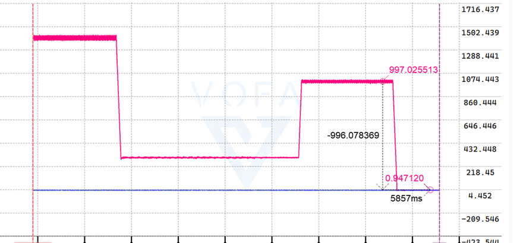

<div align="center">

# MPS-FOC STM32G431

### 开源无刷电机 FOC 控制工程 | Open-Source PMSM / BLDC FOC Project

<p>
  <a href="./LICENSE"></a>
  
  
  
  
  
</p>

</div>

> 注意，刚说明针对LCEDA项目下的V1.2版本，其余版本为F280023C下设计，未提供程序源码。V1.2为三环闭环完整的STM32G431CBT6所设计

## 目录

- [1. 项目简介](#sec-1-overview)
- [2. MPS大学计划](#sec-2-mps)
- [3. 硬件说明](#sec-3-hardware)
- [4. 软件架构](#sec-4-software)
- [5. 控制实现说明](#sec-5-control)
- [6. 快速开始](#sec-6-quickstart)
- [7. 单项测试运行视频](#sec-7-video)
- [8. 运行波形与调试截图](#sec-8-waveform)
- [9. 项目目录](#sec-9-tree)
- [10. 已知限制与后续计划](#sec-10-plan)
- [11. License](#sec-11-license)
- [12. 相关文件](#sec-12-files)

---

<a id="sec-1-overview"></a>

## 1. 项目简介

### 1.1 项目定位

本项目基于 `STM32G431CBT6`，面向 `PMSM / BLDC` 的三相 FOC 控制。仓库目标是提供一套可直接落到板级 bring-up 的开源实现，而不是教学型博客代码。

适用场景：

- 板子已经打样完成，需要尽快确认“代码怎么烧录、上电后怎么先转起来”。
- 正在做自研 FOC 控制板，需要参考一套完整的“采样 -> 快环 -> 慢环 -> telemetry -> 调参”工程结构。

### 1.2 当前工程状态

当前仓库已经具备完整主链路，不是只有框架：

- `TIM1` 互补 PWM 输出
- `ADC1 injected` 三相电流同步采样
- `ADC2 + DMA + TIM6` 母线电压 / NTC 慢变量采样
- `MA600A + SPI1` 角度反馈
- `SVPWM + dq 电流环 + 速度环 + 位置环`
- `volatile program_telemetry_t g_program_telemetry` 统一遥测对象

---

<a id="sec-2-mps"></a>

## 2. MPS大学计划

### 2.1 申请说明

MPS 中国大学计划面向高校教学、科研与竞赛项目，适合本项目所用电机控制相关器件申请。若需要 `MP6539B`、`MA600A`、`MIE1W0505`、`MP4583`、`MPM3632S`、`MP20051` 等样片，可通过对应入口申请。

- 在校大学生：使用 [MPS大学计划](https://www.monolithicpower.cn/cn/support/mps-cn-university.html)
- 非在校个人开发者：使用 [MPSNOW](https://www.monolithicpower.cn/cn/support/mps-now.html)
- 申请备注：`MPS-competition-FOC`

### 2.2 二维码入口

<p align="center">
  
</p>

---

<a id="sec-3-hardware"></a>

## 3. 硬件说明

### 3.1 硬件核心配置

| 🧩 模块  | 📦 当前实现                     | 📝 说明                    |
| ------ | --------------------------- | ------------------------ |
| 主控 MCU | `STM32G431CBT6`             | 170 MHz，带高级定时器，适合 FOC 快环 |
| PWM 输出 | `TIM1 CH1/2/3 + CH1N/2N/3N` | 中心对齐、互补输出、带死区            |
| 功率级使能  | `N_SLEEP`                   | 控制驱动器休眠 / 使能             |
| 故障输入   | `N_FAULT`                   | 当前用于驱动器故障检测              |
| 电流采样   | `ADC1_IN1 / IN3 / IN4`      | 三相独立采样，注入组同步触发           |
| 母线采样   | `ADC2_IN12`                 | `VBUS`                   |
| 温度采样   | `ADC2_IN14`                 | `NTC`                    |
| 编码器    | `MA600A + SPI1`             | 16-bit 绝对值角度反馈           |
| 调试串口   | `USART1 + DMA TX`           | VOFA / JustFloat 波形输出    |

### 3.2 电机与机构默认参数

当前默认参数位于 [`program/App/motor_params.h`](program/App/motor_params.h)：

| ⚙️ 参数   | 当前值  | 说明                                  |
| ------- | ---- | ----------------------------------- |
| 极对数     | `14` | `MOTOR_POLE_PAIRS`                  |
| 减速比     | `8`  | `MOTOR_GEAR_RATIO`                  |
| 编码器方向   | `-1` | `MOTOR_ENCODER_DIRECTION_SIGN`      |
| 编码器安装位置 | 转子侧  | `MOTOR_ENCODER_ON_OUTPUT_SHAFT = 0` |

### 3.3 硬件实物与调试环境

<table>
  <tr>
    <td align="center" width="50%">
      
    </td>
    <td align="center" width="50%">
      
    </td>
  </tr>
  <tr>
    <td align="center"><sub>整板实物图</sub></td>
    <td align="center"><sub>接线 / 调试环境图</sub></td>
  </tr>
</table>

### 3.4 与板级参数强相关的代码位置

如果更换了电机、采样电阻、运放增益或分压网络，优先修改这里：

| 📄 文件                                                      | 🔧 关键参数                     |
| ---------------------------------------------------------- | --------------------------- |
| [`program/App/motor_params.h`](program/App/motor_params.h) | 极对数、减速比、编码器方向               |
| [`program/App/program.c`](program/App/program.c)           | 分流电阻、采样增益、电流极性、母线分压、默认控制参数  |
| [`program/STM32G431_FOC.ioc`](program/STM32G431_FOC.ioc)   | ADC 通道、PWM、SPI、USART 管脚与触发源 |

---

<a id="sec-4-software"></a>

## 4. 软件架构

### 4.1 软件结构图

<p align="center">
  
</p>

### 4.2 控制流程图

<p align="center">
  
</p>

### 4.3 代码组织

| 📁 目录 / 文件                  | 🧠 职责                           |
| --------------------------- | ------------------------------- |
| `program/Core/`             | HAL 初始化、IRQ、CubeMX 生成外设配置       |
| `program/App/program.c`     | 当前真实控制主链路、快慢环调度、保护、telemetry    |
| `program/App/foc_core.c`    | Clarke / Park / 反 Park / SVPWM  |
| `program/App/ma600a.c`      | MA600A 绝对值编码器驱动                 |
| `program/App/filter.c`      | 一阶低通滤波器                         |
| `program/App/cli_uart.c`    | VOFA / DMA 串口发送                 |
| `program/App/drv_pid.c`     | 通用 Q15 PI 组件，当前不在 10 kHz 热路径主链里 |
| `program/App/motor_state.c` | 状态对象与保留状态机逻辑                    |
| `docs/`                     | 补充说明、调试文档、图像资源                  |

---

<a id="sec-5-control"></a>

## 5. 控制实现说明

### 5.1 控制流程说明：从 ADC 采样到 PWM 输出

当前工程的实际控制链路如下：

1. `TIM1` 输出中心对齐 PWM，并通过 `TRGO2 = UPDATE` 触发 `ADC1 injected`。
2. `ADC1` 一次完成 `IA / IB / IC` 三路电流采样。
3. 在 `HAL_ADCEx_InjectedConvCpltCallback()` 中读取三相原始值。
4. 启动阶段累计 `1024` 个样本，得到每相零偏。
5. 同步调度 `MA600A` 读角，更新机械角、电角度和测速窗口。
6. 原始电流码值转换为安培值，并做一阶低通。
7. 执行 `Clarke / Park`，得到 `id / iq`。
8. 位置环按 `100 Hz` 分频运行，输出机械速度参考。
9. 速度环按测速窗口更新运行，输出 `iq_ref` 或 `uq_ref`。
10. 电流环按 `10 kHz` 运行，输出 `ud_ref / uq_ref`。
11. 反 `Park` 后进入 `SVPWM`。
12. 将 `duty_a / duty_b / duty_c` 写入 `TIM1->CCR1/2/3`。

### 5.2 中断结构 / 控制周期

快环入口调用链：

```text
ADC1_2_IRQHandler
  -> HAL_ADC_IRQHandler(&hadc1)
    -> HAL_ADCEx_InjectedConvCpltCallback()
      -> program_adc_injected_conv_cplt_callback()
```

慢环入口调用链：

```text
TIM6_DAC_IRQHandler
  -> HAL_TIM_IRQHandler(&htim6)
    -> HAL_TIM_PeriodElapsedCallback()
```

当前工程对应的运行频率：

| ⏱️ 项目    | 当前值         | 触发源 / 说明                                 |
| -------- | ----------- | ---------------------------------------- |
| PWM 载波   | 约 `20 kHz`  | `TIM1 center-aligned + ARR=4249 + RCR=3` |
| 电流环      | `10 kHz`    | `ADC1 injected` 完成回调                     |
| 位置环      | `100 Hz`    | 快环分频                                     |
| 速度测速窗口   | `20` 个快环样本  | `PROGRAM_SPEED_OBSERVER_WINDOW_SAMPLES`  |
| 速度环有效更新率 | 名义 `500 Hz` | 由测速窗口更新驱动                                |
| 慢任务节拍    | `1 kHz`     | `TIM6` 中断 + `TIM6 TRGO -> ADC2`          |

慢环主要处理：

- `ADC2 + DMA` 采集 `VBUS / NTC`
- `program_task()` 在 `while(1)` 中按 `TIM6` 节拍执行后台任务和遥测输出

### 5.3 电流采样方式

本项目当前实际采用的是 **三电阻采样**，但 README 同时给出三种常见工程实现的落地差异：

| 采样方式 | 当前仓库状态   | 工程特点                                 | 迁移要点                                 |
| ---- | -------- | ------------------------------------ | ------------------------------------ |
| 单电阻  | 未实现      | 成本最低，但需要严格的扇区重构与采样窗口调度               | 需要重写采样时序、相电流重构和无效采样区处理               |
| 双电阻  | 未实现      | 常用于两相直接采样，第三相由 `ia + ib + ic = 0` 重构 | 需要补充扇区相关的缺相判断与异常窗口处理                 |
| 三电阻  | **当前实现** | 三相各自采样，bring-up 最直接，排障成本最低           | 当前使用 `ADC1_IN1 / IN3 / IN4`，适合先把环路跑通 |

当前代码的采样与控制关系：

- 硬件上采了 `IA / IB / IC` 三相。
- 控制链路中的 `Clarke` 变换当前使用 `ia / ib` 两相形式。
- `ic_meas` 保留在 telemetry 中，用于零偏校准、极性确认和 `ia + ib + ic` 一致性检查。

```text
alpha = ia
beta  = (ia + 2 * ib) / sqrt(3)
ic    = -(ia + ib)   // 控制侧重构值
```

### 5.4 坐标变换如何在代码中实现

坐标变换被独立放在 [`program/App/foc_core.c`](program/App/foc_core.c)：

| 🧮 变换  | 函数                    |
| ------ | --------------------- |
| Clarke | `foc_core_clarke()`   |
| Park   | `foc_core_park()`     |
| 反 Park | `foc_core_inv_park()` |
| SVPWM  | `foc_core_svpwm()`    |

当前主路径中的调用顺序可以概括为：

```c
foc_core_clarke(...);
foc_core_park(...);
/* dq 控制 */
foc_core_inv_park(...);
foc_core_svpwm(...);
```

`SVPWM` 当前不是查扇区表实现，而是先计算三相归一化参考电压，再根据 `vmax / vmin` 注入公共偏置，最后把占空比限制到 `0~1`。这种写法更利于工程调试和直接观察参考电压饱和情况。

### 5.5 PI 控制器如何组织

当前项目里同时存在两种 PI 组织方式，但要区分“仓库里存在”和“运行主路径在用”：

| 类型                     | 当前状态      | 说明                          |
| ---------------------- | --------- | --------------------------- |
| `program_run_pi_f32()` | **主路径在用** | 位置环 / 速度环 / 电流环统一复用         |
| `drv_pid_pi_t`         | 预留组件      | Q15 结构体 PI，目前不在 10 kHz 主链路中 |

运行中的积分状态直接挂在 `g_motor` 内：

- 位置环：`position_integral_speed`
- 速度环：`speed_integral_iq` / `speed_integral_uq`
- 电流环：`id_integral_v` / `iq_integral_v`

这意味着当前工程的实时路径优先选择“`inline/静态函数 + 显式积分状态`”的组织方式，而不是每个环都实例化一个独立 PI 对象。

### 5.6 Telemetry 变量设计

当前统一观测对象是：

```c
extern volatile program_telemetry_t g_program_telemetry;
```

该对象的职责不是“只拿来画波形”，而是把 bring-up 所需的事实状态统一汇总到一个对象里。这样做有两个直接好处：

- 调试器观察和 VOFA 输出共用同一套字段。
- 采样层、控制层、命令层、状态层不再散落成多个临时全局变量。

| 📊 层级 | 典型字段                                                      | 作用            |
| ----- | --------------------------------------------------------- | ------------- |
| 原始采样层 | `ia_raw` `ib_raw` `ic_raw` `vbus_raw`                     | 查 ADC、偏置和量程问题 |
| 工程量层  | `ia` `ib` `ic_meas` `id` `iq` `theta_elec`                | 查控制量是否正确      |
| 命令层   | `id_ref_cmd` `iq_ref_cmd` `ud_ref_cmd` `uq_ref_cmd`       | 查参考值链路是否正确传递  |
| 运行状态层 | `control_state` `driver_fault_active` `fast_loop_time_us` | 查状态机与实时性      |

如果你习惯把这个对象命名为 `g_motor_telemetry`，角色是一样的；但当前仓库实际实现以 `g_program_telemetry` 为准。

---

<a id="sec-6-quickstart"></a>

## 6. 快速开始

### 6.1 开发环境

- IDE：Keil / MDK
- 工程文件：[`program/MDK-ARM/STM32G431_FOC.uvprojx`](program/MDK-ARM/STM32G431_FOC.uvprojx)
- CubeMX 工程：[`program/STM32G431_FOC.ioc`](program/STM32G431_FOC.ioc)
- 下载方式：CMSIS-DAP Debugger

### 6.2 首次上电前检查

- 电机空载
- 电源限流
- 先接上调试器
- 不要一上来就开位置环
- 先观察静态零偏和编码器角度是否正常

### 6.3 程序上电后自动完成的内容

- `ADC1 / ADC2` 校准
- `TIM1` PWM 启动并保持 `50%` 占空比
- 三相电流零偏累计
- `ADC2 DMA` 开始采集 `VBUS / NTC`
- `MA600A` 首次读角

### 6.4 第一次跑起来的推荐配置

建议第一次出力先不要直接上速度环，而是先做开环电压测试：

```c
g_motor.current_loop_enable = 0;
g_motor.speed_loop_enable = 0;
g_motor.position_loop_enable = 0;
g_motor.ud_ref = 0.0f;
g_motor.uq_ref = 0.5f;   /* 从小值开始 */
g_motor.run_request = 1;   /*  最核心的启动信号，启动这个才开始运行发波 */
```

程序会先自动做对齐，再进入基于编码器角度的手动电压模式。

### 6.5 首次需要看的变量

| 👀 变量                  | 正常现象      |
| ---------------------- | --------- |
| `current_offset_ready` | 上电后置位     |
| `ia / ib / ic_meas`    | 静止时接近 `0` |
| `i_abc_sum`            | 接近 `0`    |
| `ma600a_angle_rad`     | 手动转动时连续变化 |
| `driver_fault_active`  | `0`       |
| `fast_loop_overrun`    | `0`       |

### 6.6 三环由内到外的闭环调试顺序

不要跳步，建议严格按“由内到外”执行：

| 阶段      | 🎯 目标  | 🔧 推荐配置           | 👀 重点观察                                          |
| ------- | ------ | ----------------- | ------------------------------------------------ |
| Stage 0 | 静态链路确认 | `run_request = 0` | `ia/ib/ic` `vbus` `ma600a_angle_rad`             |
| Stage 1 | 验证出力方向 | 关速度环、关位置环         | `uq_ref` `theta_elec`                            |
| Stage 2 | 调电流环   | 开电流环，关外环          | `id` `iq` `ud_ref_cmd` `uq_ref_cmd`              |
| Stage 3 | 调速度环   | 开速度环，位置环保持关闭      | `speed_ref_mech_rpm` `speed_meas_mech_rpm`       |
| Stage 4 | 调位置环   | 最后再开位置环           | `position_ref_mech_rad` `position_meas_mech_rad` |

### 6.7 当前运行默认参数

以下为当前主路径实际生效的默认参数，来源于 [`program/App/program.c`](program/App/program.c)：

| 🧪 参数         | 当前值       |
| ------------- | --------- |
| `current_kp`  | `2.5761`  |
| `current_ki`  | `4555.31` |
| `speed_kp`    | `0.003`   |
| `speed_ki`    | `0.03`    |
| `position_kp` | `4.0`     |
| `position_ki` | `0.0`     |
| `iq_limit`    | `8.0 A`   |

更详细的 bring-up 和三环调试步骤见 [`docs/quick-start.md`](docs/quick-start.md)。

---

<a id="sec-7-video"></a>

## 7. 单项测试运行视频

GitHub 页面通常不会在 README 内直接内嵌本地 `mp4` 播放器，因此这里统一使用相对路径索引。点击即可跳转到仓库内视频文件。

| #   | 测试项        | 说明                                    | 视频                                                                                      |
| --- | ---------- | ------------------------------------- | --------------------------------------------------------------------------------------- |
| 1   | 电源输入范围测试   | Power Supply Input Voltage Range Test | [点击查看](experiment/video/Test1%20Power%20Supply%20%20Input%20Voltage%20Range%20Test.mp4) |
| 2   | 启停性能测试     | StartStop Performance                 | [点击查看](experiment/video/Test2%20StartStop%20Performance.mp4)                            |
| 3   | 速度控制精度测试   | Speed Control Accuracy                | [点击查看](experiment/video/Test3%20Speed%20Control%20Accuracy.mp4)                         |
| 4   | 位置控制精度测试   | Position Control Accuracy             | [点击查看](experiment/video/Test4%20Position%20Control%20Accuracy.mp4)                      |
| 5   | 负载输出能力测试   | Load Output Capability                | [点击查看](experiment/video/Test5%20Load%20Output%20Capability.mp4)                         |
| 5-2 | 负载输出能力补充测试 | Load Output Capability                | [点击查看](experiment/video/Test5-2%20Load%20Output%20Capability.mp4)                       |

---

<a id="sec-8-waveform"></a>

---

<a id="sec-9-tree"></a>

## 8. 项目目录

```text
.
|-- README.md
|-- LICENSE
|-- circurit/                    # 原理图、器件手册、Gerber（目录名沿用当前仓库拼写）
|-- docs/
|   |-- quick-start.md           # 快速开始与三环调试说明
|   |-- figures/                 # 软件架构图、控制流程图
|   `-- images/                  # README 图片资源
|-- experiment/
|   |-- photo/                   # 波形截图、VOFA 截图、实拍图
|   |-- video/                   # 单项测试视频
|   `-- 测试报告.docx
`-- program/
    |-- STM32G431_FOC.ioc        # CubeMX 工程
    |-- Core/                    # HAL / IRQ / CubeMX 生成代码
    |-- App/                     # 控制算法与项目逻辑
    `-- MDK-ARM/                 # Keil 工程
```

---

<a id="sec-10-plan"></a>

## 9. 已知限制与后续计划

### 9.1 当前已确认的限制

- 当前采样方案面向三电阻硬件，不包含单电阻重构实现。
- `MA600A` 当前是阻塞式 SPI 读角，继续追求更高快环频率时需要评估时序占用。
- 在线调参目前主要依赖调试器改变量，尚未形成完整命令协议。
- 当前故障链路以 `N_FAULT` 为主，更多软件保护仍可继续增强。

---

<a id="sec-12-files"></a>

## 12. 相关文件

- [快速开始与三环调试文档](docs/quick-start.md)
- [软件结构图](docs/figures/software-architecture.svg)
- [控制流程图](docs/figures/control-flow.svg)
- [CubeMX 工程](program/STM32G431_FOC.ioc)
- [Keil 工程](program/MDK-ARM/STM32G431_FOC.uvprojx)
- [测试报告](experiment/%E6%B5%8B%E8%AF%95%E6%8A%A5%E5%91%8A.docx)
- [实验图片目录](experiment/photo)
- [实验视频目录](experiment/video)
