<div align="center">

# MPS-FOC STM32G431

### 开源无刷电机 FOC 控制工程 · 硬件版本 V1.3

<p>
  
  
  
  
  
</p>

</div>

## 目录

- [1. 项目概况](#sec-1)
- [2. MPS 大学计划与器件申领](#sec-2)
- [3. 板级接口](#sec-3)
- [4. 软件结构](#sec-4)
- [5. 控制接口](#sec-5)
- [6. 控制链路实现](#sec-6)
- [7. 测试结果](#sec-7)
- [8. 上电调试](#sec-8)
- [9. 新电机适配](#sec-9)
- [10. 已知限制](#sec-10)
- [11. 许可证说明](#sec-11)

---

<a id="sec-1"></a>

## 1. 项目概况

固件以 `STM32G431CBT6` 为主控，驱动三相 PMSM/BLDC 关节电机，采用 `id = 0` 的转子磁场定向控制。控制链路覆盖三相电流采样、编码器角度观测、电流/速度/位置三环、功率级保护与上位机遥测，并配套板级 bring-up 流程和验收测试数据。

默认参数针对 `GIM6010-48` 级别关节电机：14 极对、8:1 减速、编码器装在转子侧、方向符号 `-1`。额定参数见 [`docs/GIM6010-48电机参数表.xlsx`](docs/GIM6010-48电机参数表.xlsx)，`GIM6010-8` 的三种电压配置见 [`docs/GIM6010-8关节电机参数表.docx`](docs/GIM6010-8关节电机参数表.docx)。代码中的 `Kt` 取转子侧等效值 `0.60 N·m/A`，由输出轴扭矩常数 `4.7 / 8` 推算，与转速常数互验。

### 1.1 仓库结构

```text
.
├── README.md
├── LICENSE
├── 3dmodel/                 # 3D 模型：整机、力臂、对拖平台
├── circurit/                # V1.3 硬件设计文件：EDA 工程、Gerber、网表
├── datasheet/               # 器件手册
├── docs/                    # 上电调试说明、电机参数表、新电机适配流程
├── figure/                  # README 配图：实物、平台、测试曲线、热像
├── program/
│   ├── STM32G431_FOC.ioc    # CubeMX 工程
│   ├── Core/                # HAL 初始化、中断、外设配置
│   ├── App/                 # 控制算法与应用逻辑
│   ├── Drivers/             # CMSIS 与 STM32G4 HAL
│   └── MDK-ARM/             # Keil 工程
└── video/                   # 视频脚本与图形素材
```

硬件设计同步发布于嘉立创开源广场：[STM32G431-MPS-COMPETITION-FOC](https://oshwhub.com/banzang/project_bpnjkxhi)。`software/` 目录本地保留 MA600A 厂商 MagAlpha 评估软件安装包，未纳入版本管理。

### 1.2 硬件组成

- `STM32G431CBT6` — 主控，170 MHz，带高级定时器
- `MA600A` — 16 bit 绝对值磁编码器，位置反馈
- `MP6539B` — 三相半桥预驱，驱动功率级
- `MP4583` — 宽输入 DCDC，48 V 母线供电
- `MIE1W0505` — 栅极驱动隔离供电
- `MPM3632S` — 3.3 V POL，为 MCU 与编码器供电
- `MP20051` — 待机与辅助电路供电

其余器件手册见 [`datasheet/`](datasheet)，包含 `BSC030N08NS5`（功率 MOSFET）、`INA240`（电流检测放大器）、`MA600`/`MA600A` 等。

<p align="center">
  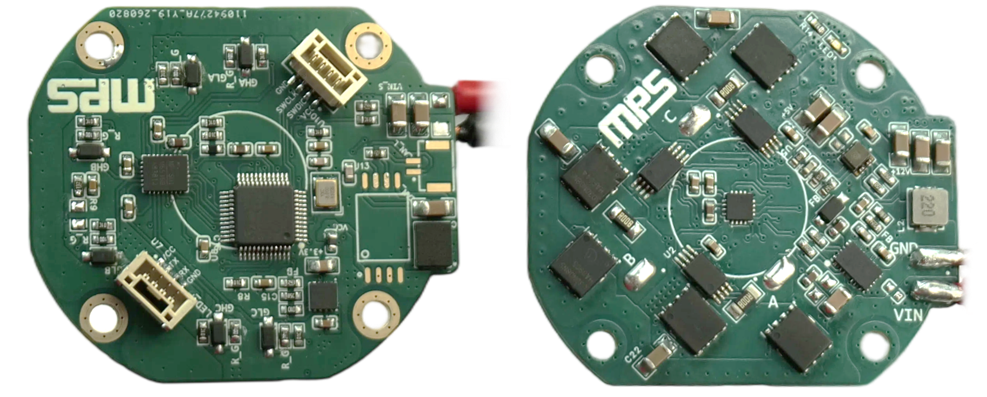
  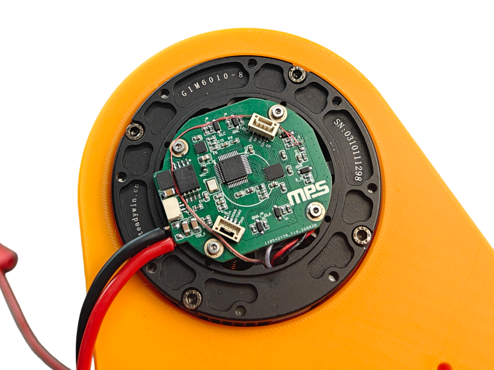
</p>

---

<a id="sec-2"></a>

## 2. MPS 大学计划与器件申领

本项目源自 2025 MPS“智驱未来”机器人芯动力设计挑战赛，赛事说明见 [2025 MPS“智驱未来”机器人芯动力设计挑战赛](https://docs.qq.com/doc/DY1BZckttV2ZQaEhj)。

<p align="center">
  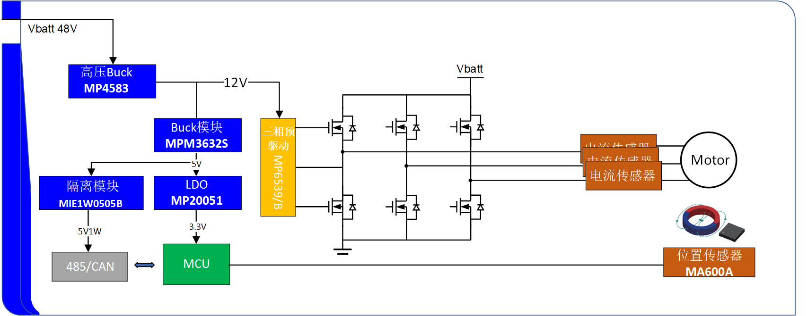
</p>

工程复刻所需的同款芯片可通过 MPS 样品申领入口免费获取：<https://app-u.jingsocial.com/surl/JNH9Kul>

<p align="center">
  
  
</p>

---

<a id="sec-3"></a>

## 3. 板级接口

### 3.1 功率接口与引脚映射

电源与 UVW 三相出线端位于板边。若上电后电机无法正常运转，优先核对编码器正方向与三相相序是否一致：可将 `CFG_ENC_DIR_SIGN` 取反，或对调任意两根相线。

<p align="center">
  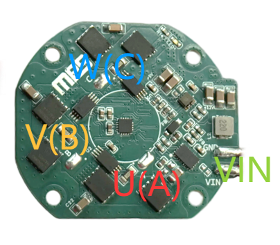
</p>

引脚映射以 V1.3 硬件和 CubeMX 配置为准，来源为 `program/Core/Src/` 下的 `tim.c`、`adc.c`、`spi.c`、`usart.c`、`gpio.c`：

- 三相 PWM：`TIM1_CH1/2/3 + CH1N/2N/3N` → `PA8/PA9/PA10` + `PC13/PB0/PB1`，六路互补，接 `MP6539B`
- 三相电流采样：`ADC1_IN1 / IN3 / IN4` → `PA0 / PA2 / PA3`，注入组与 PWM 同步
- 母线电压采样：`ADC2_IN12` → `PB2`，由 `ADC2 + DMA` 周期采样
- NTC 温度采样：`ADC2_IN14` → `PB11`
- 编码器：`SPI1 + ENC_CS` → `PA5 / PA6 / PA7` + `PA4`，对接 `MA600A`
- 功率级使能：`N_SLEEP` → `PB14`，`1 = 使能`，`0 = 关断`
- 驱动故障输入：`N_FAULT` → `PB15`，上拉输入，低有效
- 调试串口：`USART1` → `PB6 / PB7`，`115200 8N1`
- 预留通信口：`FDCAN1` → `PA11 / PA12`，仅完成 CubeMX 初始化

板载通讯接口按丝印连接。

<p align="center">
  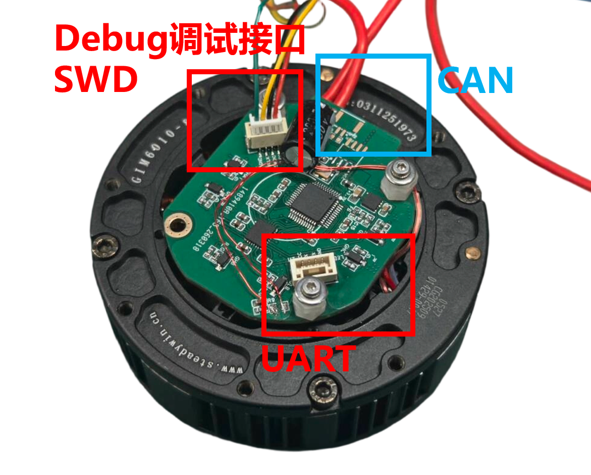
</p>

### 3.2 通信外设配置

- `SPI1` — 主机、16 bit、`CPOL=1`、`CPHA=2EDGE`、软 NSS、分频 8，专用 `MA600A` 角度读取
- `USART1` — `115200 8N1`、无流控、TX DMA，输出 VOFA JustFloat 遥测；RX 已预留但未实现上位机命令协议
- `FDCAN1` — 保留 CubeMX 默认初始化参数，未作为稳定外部接口开放
- `TIM6 + ADC2 DMA` — `1 kHz`，触发母线电压/NTC 采样并驱动 1 ms 系统节拍

---

<a id="sec-4"></a>

## 4. 软件结构

### 4.1 模块划分

<p align="center">
  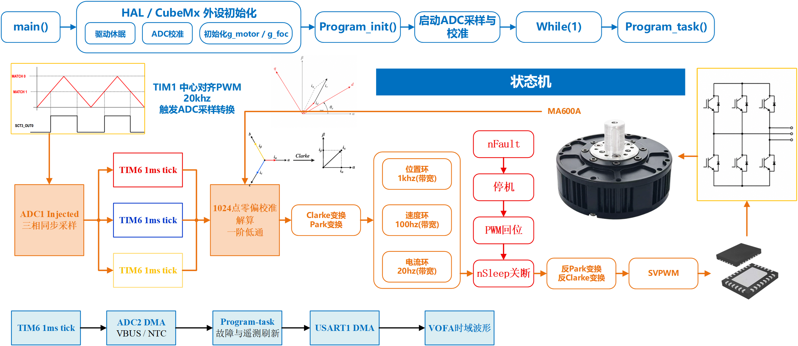
</p>

- `program/Core/` — HAL 初始化、中断向量、CubeMX 外设配置
- `program/App/program.c` — 胶水层：初始化、后台遥测、HAL 回调转发
- `program/App/motor_ctrl.c` — 控制核心：状态机、保护、对齐、观测器、三环、模式分发
- `program/App/motor.h` — 对外接口 `g_cmd` / `g_fb`，以及模式与故障枚举
- `program/App/app_config.h` — 全部参数的唯一出处：电机、机构、板级采样链、默认增益、保护阈值
- `program/App/board.c` — 板级抽象：ADC 换算、NTC、GPIO、TIM1 占空比、DWT 计时
- `program/App/units.h` — 角度包绕、单位换算、坐标系变换，全部 `static inline`
- `program/App/foc_core.c` — Clarke / Park / 反 Park / SVPWM，缓存 `sin/cos`
- `program/App/ma600a.c` — MA600A SPI 驱动：非阻塞读角、跳变剔除、通讯错误统计
- `program/App/filter.c` — 一阶低通滤波器
- `program/App/cli_uart.c` — UART 文本与 VOFA JustFloat 发送

### 4.2 执行上下文与频率

全部控制、保护与慢速采样都在 `ADC1` 注入组完成中断这一个上下文内执行，慢任务按 `CFG_SLOW_DIV` 分频，`g_fb` 的读写不存在跨上下文竞态。

- PWM 载波 — 约 `20 kHz`，`TIM1` 中心对齐，`ARR=4249`，`RCR=3`
- 快环（电流环）— `10 kHz`，`ADC1` 注入组完成中断，`T1_TRGO2` 触发
- 速度环 — 名义 `2 kHz`，每 `CFG_SPD_WINDOW_SAMPLES = 5` 个快环样本产生一次速度估计
- 位置环 — `200 Hz`，快环内按 `CFG_POS_DT_S` 分频
- 慢任务 — `1 kHz`，快环内 `CFG_SLOW_DIV = 10` 分频：母线/NTC 换算、过压欠压锁存、派生单位
- 母线/NTC 采样 — `1 kHz`，`TIM6 TRGO → ADC2 + DMA`
- 后台遥测 — 约 `333 Hz`（3 ms），`while(1)` 中的 `program_task()`；VOFA JustFloat 共 5 路：两轴实际电流、输出轴转速、输出轴位置、编码器机械角，详见 [`docs/program-debug.md`](docs/program-debug.md#4-新-vofa-通道表)

---

<a id="sec-5"></a>

## 5. 控制接口

对外接口只有两个全局结构体，定义在 [`program/App/motor.h`](program/App/motor.h)：

```c
extern volatile motor_cmd_t g_cmd;   /* 用户写：模式、开关、目标值、调参量 */
extern volatile motor_fb_t  g_fb;    /* 用户读：状态、故障、全部测量量 */
```

### 5.1 命令接口 `g_cmd`

完整字段定义见 `motor.h`，调参常用项如下。操作顺序固定为**先设 `mode` 和目标值，最后置 `run = 1`**。

- `mode` — 工作模式，见 5.2
- `run` — 总运行开关，置 `1` 后按 `mode` 启动
- `iq_lim_a` — 电流限幅，同时限制电流给定和速度环输出
- `iq_a` — `CURRENT` 模式 q 轴电流目标
- `spd_rpm` — `SPEED` 模式转子侧转速目标
- `pos_deg` — `POSITION` 模式输出轴角度目标，`0~360`
- `cur_kp` `cur_ki` — 电流环 PI
- `spd_kp` `spd_ki` — 速度环 PI
- `spd_lpf_hz` — 测速低通截止频率
- `pos_kp` `pos_ki` `pos_kd` — 位置环参数，`kd` 为测速阻尼
- `pos_spd_lim_rad_s` — 位置环输出速度限幅

电压模式的 `ud_v` / `uq_v`、`PWM_TEST` 的占空比、`clear_fault` 等操作项见 [`docs/quick-start.md`](docs/quick-start.md)。

### 5.2 运行模式

- `MOTOR_MODE_DISABLED` — 功率级关闭，PWM 保持 50%，安全态
- `MOTOR_MODE_PWM_TEST` — 固定占空比发波，验证 `TIM1 + MP6539B`
- `MOTOR_MODE_VOLTAGE` — d/q 轴电压直接给定，角度来源由 `volt_open_angle_en` 决定
- `MOTOR_MODE_CURRENT` — 电流环，d/q 轴电流直接给定
- `MOTOR_MODE_SPEED` — 速度环，给定转子侧转速
- `MOTOR_MODE_POSITION` — 位置环，给定输出轴角度

后三种模式需要编码器并执行零位对齐。运行中可直接修改 `mode`，环路状态自动复位，闭环类模式之间切换保留对齐结果；每次 `run = 1` 启动闭环类模式都会重新对齐。

### 5.3 反馈接口 `g_fb`

- 状态 — `state` `mode_active` `fault_bits` `align_done` `offset_ready` `enc_valid` `drv_fault`
- 电流 — `ia_a` `ib_a` `ic_a` `i_sum_a` `id_a` `iq_a` `id_ref_a` `iq_ref_a`
- 角度与位置 — `theta_elec_rad` `enc_deg` `align_ofs_rad` `pos_out_deg` `pos_ref_deg`
- 速度 — `spd_rot_rpm` `spd_out_rpm` `spd_ref_rpm`
- 电压与温度 — `vbus_v` `ntc_c` `ud_v` `uq_v` `volt_lim_v`
- 占空比与实时性 — `duty_a` `duty_b` `duty_c` `loop_us` `loop_us_max` `overrun_cnt`
- 编码器统计 — `enc_samples` `enc_reject` `enc_err`

故障位掩码：`FAULT_BIT_DRIVER`（`0x01`，`N_FAULT`）、`FAULT_BIT_OVERCURRENT`（`0x02`）、`FAULT_BIT_OVERVOLT`（`0x04`）、`FAULT_BIT_UNDERVOLT`（`0x08`）、`FAULT_BIT_ENCODER`（`0x10`）。

---

<a id="sec-6"></a>

## 6. 控制链路实现

### 6.1 从电流采样到 PWM 更新

`TIM1` 以中心对齐方式输出六路互补 PWM，并通过 `TRGO2 = UPDATE` 触发 `ADC1` 注入组。每拍快环的执行顺序为：

1. 登记三相电流原始码值；未完成零偏校准时继续累计样本。
2. 发起下一次编码器 SPI 读角，并消费已完成样本，更新机械角、连续角与测速窗口。
3. 计算本拍电角度（快环唯一计算点），写入 `foc_core` 的 `sin/cos` 缓存。
4. 原始码值扣除零偏后换算为安培值，执行 Clarke / Park 得到 `id`、`iq`。
5. 按 `CFG_SLOW_DIV` 分频执行慢任务。
6. 汇聚快环与慢任务产生的故障位，必要时进入 FAULT 锁存。
7. 处理故障清除请求。
8. 按状态机执行 IDLE / ALIGN / RUN / FAULT 分支，RUN 分支内分发到当前模式。
9. 反 Park 后经 SVPWM 得到三相占空比，写入 `TIM1->CCR1/2/3`，并回写 `g_fb` 状态镜像。
10. 用 DWT 周期计数统计本次快环耗时，超时则累加 `overrun_cnt`。

其中第 4 步的 Clarke 与 Park 变换在三个坐标系之间依次转换：

| 三相静止坐标系 abc                   | 两相静止坐标系 αβ                   | 两相旋转坐标系 dq                   |
| ----------------------------- | ---------------------------- | ---------------------------- |
|  |  |  |
| 三相电流                          | Clarke 变换后                   | Park 变换后                     |

### 6.2 电流采样与零偏校准

三相电流经分流电阻和固定增益放大后送入 `ADC1` 注入组，由 `TIM1 TRGO2` 触发，与 PWM 同步采样。上电后累计 `CFG_OFFSET_SAMPLES = 1024` 个样本（约 100 ms）求每相零偏，置位 `g_fb.offset_ready`。

换算关系为 `i = (raw - raw_offset) × Vref / 4095 / (G × Rshunt)`，当前采样链为 `Rshunt = 8 mΩ`、`G = 20`，对应 `0.16 V/A`，满量程约 `±10.3 A`。相电流极性由 `CFG_CUR_SIGN_IA/IB/IC` 逐个配置，某相方向相反时取 `-1`。

### 6.3 编码器角度观测与零位对齐

`MA600A` 通过 `SPI1` 读取 16 bit 绝对角度，由快环每拍发起一次非阻塞传输。驱动对相邻样本做跳变检查：单帧角度变化超过 1024 个计数（约 5.6° 机械角）判为非法样本，连续 4 次坏样本后将 `data_valid` 清零并锁存编码器故障。

闭环类模式启动时执行零位对齐：以 `CFG_ALIGN_UD_V`（默认 1.2 V）的 d 轴电压将转子锁定在电角度 0 位置，保持 `CFG_ALIGN_HOLD_TICKS = 8000` 个快环节拍（约 0.8 s），并在末段 512 拍对编码器电角度做正弦/余弦平均，得到零位偏置 `g_fb.align_ofs_rad`。该电压不受 `iq_lim_a` 限制，对齐电流只由相电阻决定，电压越高纯铜耗越大。

机构换算集中在 [`program/App/units.h`](program/App/units.h)：编码器机械角经方向符号与减速比换算为转子机械角，再乘以极对数得到电角度；输出轴量由转子量除以减速比得到。

### 6.4 三环结构与参数整定

三个环路的带宽在 [`program/App/app_config.h`](program/App/app_config.h) 中独立配置，PI 增益在上电时按带宽自动计算。

<p align="center">
  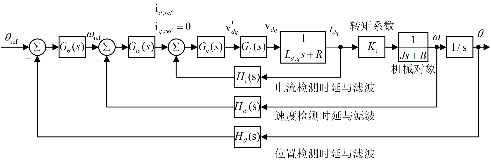
</p>

- 电流环 — `10 kHz`，对象为等效 R/L 串联，按模最佳整定 `Kp = 2π·f_bw·L_eq`、`Ki = 2π·f_bw·R_eq`，默认 `500 Hz` 对应 `cur_kp = 1.288`、`cur_ki = 2277.65`
- 速度环 — 名义 `2 kHz`，对象为 `Kt/J` 积分，按二阶整定 `ωn = 2π·f_bw`、`ζ = 1`，结果除以极对数换算到电角速度域，默认 `30 Hz` 对应 `spd_kp = 0.01346`、`spd_ki = 1.26895`
- 位置环 — `200 Hz`，对象近似纯积分 `1/s`，`Kp = 2π·f_bw`，默认 `5 Hz` 对应 `pos_kp = 31.42`、`pos_ki = 0`、`pos_kd = 0.3`

电流环带宽受 PWM 更新率限制：当前更新率为 `5 kHz`，`500 Hz` 时相位裕度约 `45°`，接近 `800 Hz` 时只剩约 `18°`，会出现振铃并可能触发过流保护。需要更高带宽时应先在 CubeMX 中减小 `TIM1` 的 `RCR` 以提高更新率。

速度反馈链的等效延迟约 `1.1 ms`，由 SPI 样本龄、5 点测速窗群延迟、`300 Hz` 测速低通和 `2 kHz` 零阶保持组成，对应速度环带宽上限约 `60 Hz`。`CFG_MOTOR_INERTIA_KGM2` 为估计值，是速度环增益的实际旋钮：振荡时减小，响应过软时增大。

`g_cmd.iq_lim_a` 同时限制电流给定和速度环输出，默认 `5 A`，过流保护阈值为 `CFG_PROT_PHASE_OC_A = 10 A`，为瞬态超调保留余量。

### 6.5 保护、状态机与遥测

快环每拍检查 `N_FAULT` 电平、三相电流幅值和编码器有效性；母线过压（`> 65 V`）、欠压（`< 12 V`）在 `1 kHz` 慢任务中锁存。任一故障位置位后进入 FAULT 状态并关闭功率级，故障源消失后写 `g_cmd.clear_fault = 1` 回到 IDLE。欠压仅在非待机状态下锁存，避免只上逻辑电时卡在故障态。

后台 `program_task()` 只负责遥测输出，不接触控制量。

---

<a id="sec-7"></a>

## 7. 测试结果

### 7.1 验收项目

- 电源输入范围 — 标准 `48 V ±15%`，40~56 V 范围内正常运行
- 启停性能 — 标准为空载启动平稳无振动，见验收视频
- 速度控制精度 — 目标 100 / 200 rpm，输出轴 100 rpm 下扰动约 3 rpm，200 rpm 下约 8 rpm
- 位置控制精度 — 目标 90° / 180°，阶跃响应基本无静差
- 负载输出能力 — 10 cm 力臂带载 2 kg，相电流 ≥ 6 A；分别按 60 W 与 180 W 等级完成测试
- 持续带载温升 — 10 cm 力臂、2 kg 负载、48 V 母线、265 rpm 连续运行，热像见 7.4

验收视频见 [STM32-MPS-FOC电机全流程测试](https://www.bilibili.com/video/BV1HWXkBHEVS/)，流体负载补充测试见 [30mins 流体负载测试](https://www.bilibili.com/video/BV1bgvYBtEYp/)。

### 7.2 对拖测试平台

双电机对拖平台左侧为驱动电机，右侧为发电机，整流后接入电子负载或实验台架。

| 对拖平台                    | 测量设备                   |
| ----------------------- | ---------------------- |
| 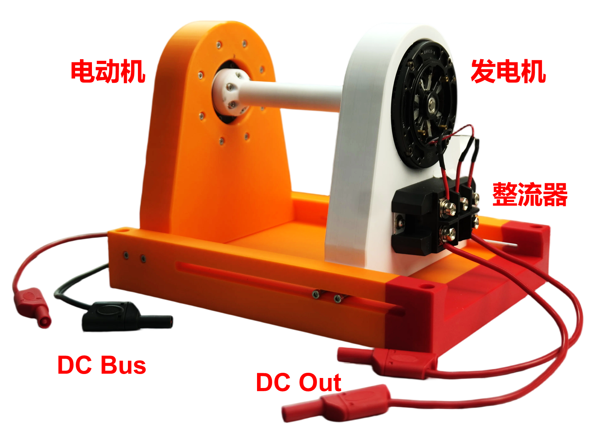 | 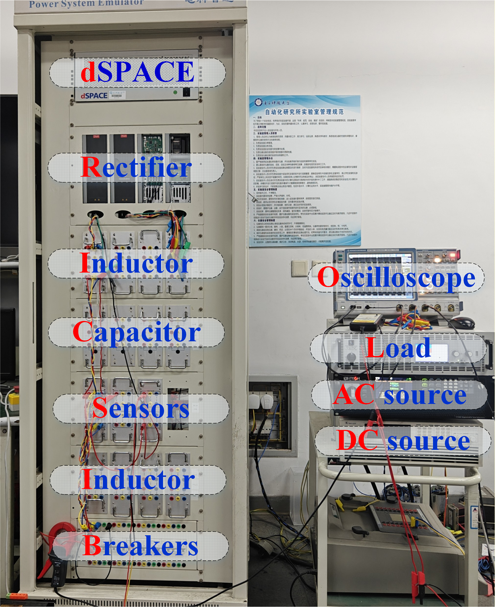 |

### 7.3 速度环与位置环响应

| 速度环跟踪                                                    | 速度环阶跃                                                    |
| -------------------------------------------------------- | -------------------------------------------------------- |
| 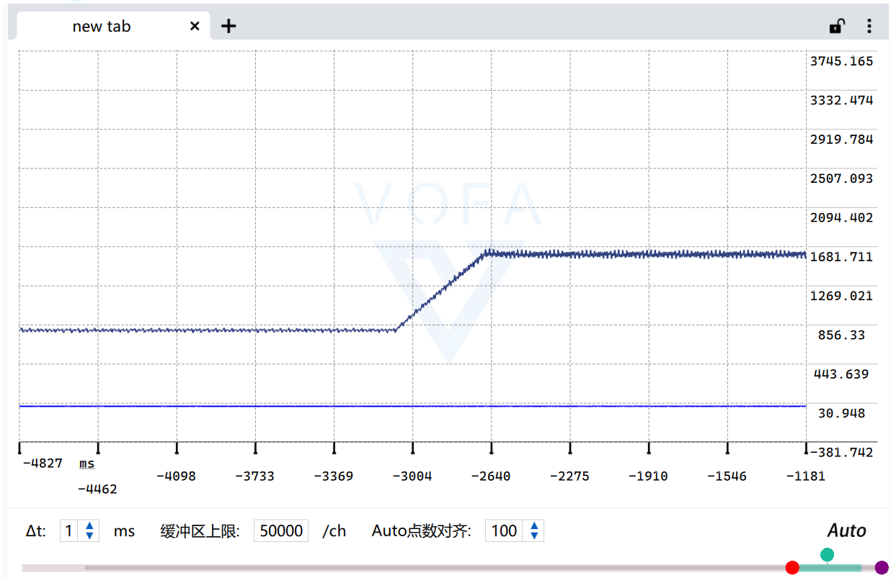 | 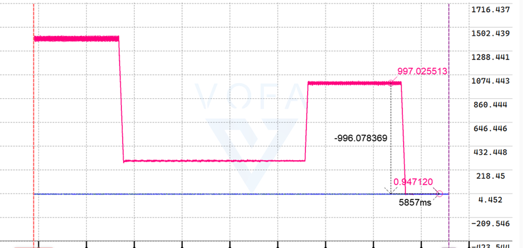 |

<p align="center">
  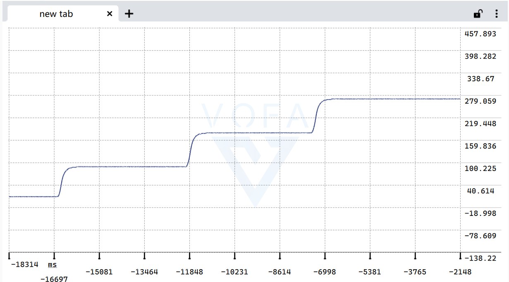
</p>

图中转速为减速箱输出轴之前的机械转速。

### 7.4 带载温升

| 带载 2 min 热像                   | 带载 20 min 热像                  |
| ----------------------------- | ----------------------------- |
| 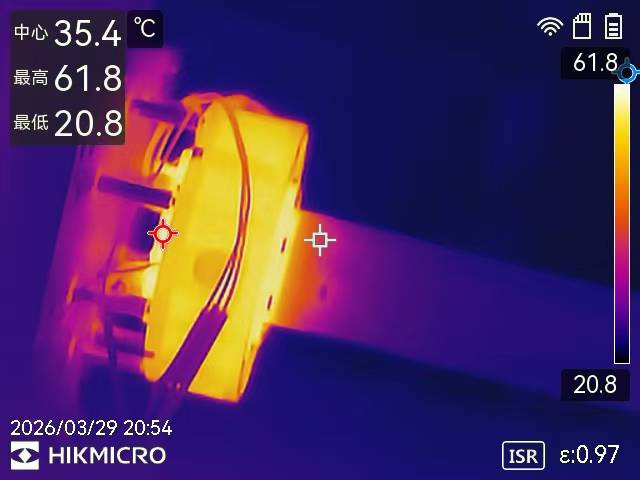     | 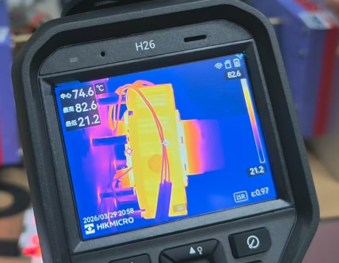    |
| 中心温度约 `35.4 °C`，最高约 `61.8 °C` | 壳温约 `74.6 °C`，最高热点约 `82.6 °C` |

---

<a id="sec-8"></a>

## 8. 上电调试

完整的上电自检与三环整定步骤见 [`docs/quick-start.md`](docs/quick-start.md)，这里只列关键顺序与判据。

当前程序的故障触发条件、清除流程、三环小步进测试及新版 VOFA 通道见 [`program 调试说明`](docs/program-debug.md)。

开发环境为 Keil MDK，工程文件 [`program/MDK-ARM/STM32G431_FOC.uvprojx`](program/MDK-ARM/STM32G431_FOC.uvprojx)，CubeMX 工程 [`program/STM32G431_FOC.ioc`](program/STM32G431_FOC.ioc)，下载器 CMSIS-DAP。

### 8.1 上电自检

程序上电后自动完成 `ADC1`/`ADC2` 校准、启动 `TIM1` 并保持 50% 占空比、累计三相电流零偏、启动 `ADC2 + DMA` 采样母线电压与 NTC、读取一次 MA600A 角度。保持 `g_cmd.run = 0`，确认：

- `g_fb.offset_ready` 上电约 100 ms 后置 `1`
- `g_fb.ia_a` / `ib_a` / `ic_a` 静止时接近 `0 A`，`g_fb.i_sum_a` 接近 `0`
- `g_fb.vbus_v` 与实际母线电压同量级
- `g_fb.enc_deg` 手动转动时连续变化，`g_fb.drv_fault` 与 `g_fb.fault_bits` 为 `0`
- `g_fb.loop_us` 稳定小于 `100 us`，`overrun_cnt` 不增长

### 8.2 发波与开环验证

验证功率级发波链路时断开电机：

```c
g_cmd.mode = MOTOR_MODE_PWM_TEST;
g_cmd.duty_a = 0.30f;
g_cmd.duty_b = 0.40f;
g_cmd.duty_c = 0.60f;   /* 三相不相等，便于示波器辨认 */
g_cmd.run = 1;
```

确认 `PA8/PA9/PA10` 与 `PC13/PB0/PB1` 输出 `20 kHz` 互补 PWM 后退出该模式，改用开环电压模式确认出力方向：

```c
g_cmd.mode = MOTOR_MODE_VOLTAGE;
g_cmd.volt_open_angle_en = 1;          /* 开环积分角度，跳过对齐 */
g_cmd.open_spd_elec_rad_s = 200.0f;    /* 电角速度 ≈ 136 rpm 转子 */
g_cmd.uq_v = 0.5f;
g_cmd.run = 1;
```

`volt_open_angle_en = 0` 时使用编码器闭环角度，启动前会自动执行 6.3 所述的零位对齐。

### 8.3 闭环调试顺序

由内到外依次闭合，每一步确认稳定后再进入下一步：

- 电流环 — `MOTOR_MODE_CURRENT`，`id_a = 0`、`iq_a = 0.1~0.3 A`、`iq_lim_a = 1 A`，观察 `id_a` `iq_a` `ud_v` `uq_v` `volt_lim_v`
- 速度环 — `MOTOR_MODE_SPEED`，`spd_rpm = 20`、`iq_lim_a = 1 A`，观察 `spd_ref_rpm` `spd_rot_rpm` `spd_out_rpm` `iq_ref_a`
- 位置环 — `MOTOR_MODE_POSITION`，`pos_spd_lim_rad_s = 8`，观察 `pos_ref_deg` `pos_out_deg`

---

<a id="sec-9"></a>

## 9. 新电机适配

适配前需确认极对数、减速比、编码器安装侧与方向，以及相电阻、相电感、扭矩常数、额定/峰值电流和母线电压范围。极对数、减速比、编码器安装侧和方向任一项填错，都会使闭环从负反馈变为正反馈，表现为对齐失败、抖动、发热或无力。

全部需要修改的参数集中在 [`program/App/app_config.h`](program/App/app_config.h) 的 `CFG_MOTOR_*`、`CFG_ENC_*`、`CFG_CUR_*` 与 `CFG_IQ_LIM_A_DEFAULT`。`CFG_CUR_EQ_R_OHM` 和 `CFG_CUR_EQ_L_H` 是当前板级在 `10 kHz` 快环下用于 PI 计算的等效对象参数，不等同于电机手册的相间电阻与电感，换电机时先用新电机参数估初值，不要直接照搬。

电流环带宽建议从 `300~500 Hz` 起步，`iq_lim_a` 先压到理论安全值的 `20%~30%`，系统稳定后再逐步提高。完整的参数辨识、限流估算与验收判据见 [`docs/适配新电机标准流程.docx`](docs/适配新电机标准流程.docx)。

---

<a id="sec-10"></a>

## 10. 已知限制

### 10.1 高速运行噪声

判别实验表明：开环 `VOLTAGE` 模式在相同转速下噪声更大，速度环增益减半对噪声无明显影响，说明噪声不由控制环路放大，来源在电机本体、换相角误差或减速箱。首要嫌疑是 MA600A 未做 INL 校准导致的换相角误差，其次是行星减速箱的固有机械噪声。需要注意的是，VOFA 遥测在高转速下的纹波会混叠，早期观察到的“2 倍输出轴频率波动”只能作为线索。

MA600A 手册指标为校准前 `< 0.6°`、片上 32 点校准后 `< 0.1°`，当前反馈链路尚未做 INL 校准。

### 10.2 位置环静摩擦抖动

位置环在目标角度附近会出现小范围低频抖动，原因是减速箱静摩擦力与速度环积分共同作用。当前固件通过保持/爬行逻辑抑制该现象，阈值见 `app_config.h` 中的 `CFG_POS_HOLD_*` 与 `CFG_POS_CREEP_*`；诊断时可将 `g_cmd.pos_hold_en` 置 `0` 旁路该逻辑做对照。

速度环若出现剧烈抖动，优先检查控制板与电机的安装距离和接地，尽量使控制板贴近电机安装，并避免板背 VIN 开窗部分与电机导电件接触。

---

<a id="sec-11"></a>

## 11. 许可证说明

本项目基于 **GNU General Public License v3.0** 发布，详细条款见 [`LICENSE`](LICENSE)。衍生作品需同样以 GPL 3.0 发布并保留源码。

```text
MPS-FOC STM32G431
Copyright (C) 2026 MPS China University Program
This program is free software: you can redistribute it and/or modify
it under the terms of the GNU General Public License as published by
the Free Software Foundation, either version 3 of the License.
```
