# 第二章-硬件设计计算

- Source: `第二章-硬件设计计算.pptx`
- Total slides: 20

## Slide 1

第二章：硬件设计计算

需求分析 → 芯片选型 → 原理图设计 → PCB Layout → 测试验证。

## Slide 2

- 0-5s
- 同样先来几秒钟快闪 大概是板子焊接，然后聚焦于板子的运镜视频

### Speaker Notes

先来几秒钟快闪

## Slide 3

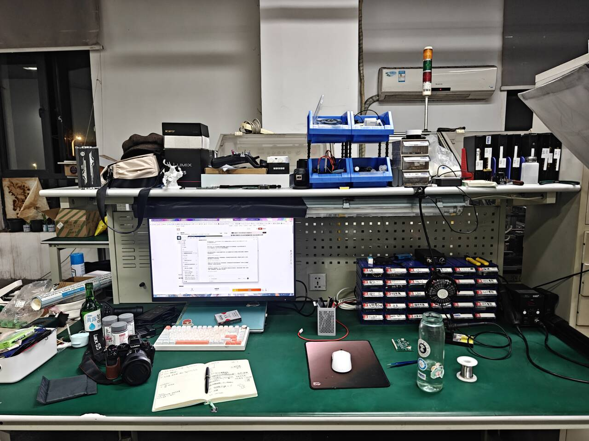

同样这个场景

### Speaker Notes

- 好的，大家好！本期视频我们将进入器件选型与硬件设计篇。
- 在这一章节我们会结合关节电机 FOC 的实际指标，分析系统需求和关键参数，用实际数据说明这套 MPS 方案的选型依据。随后，我们会结合器件手册和应用场景，讲解原理图设计与 PCB Layout 的关键思路，将整块 FOC 控制板像剥洋葱一样逐层拆开。
- 话不多说，我们先进入指标分析part。

## Slide 4

FOC 基本原理——坐标变换如何让电机转起来

跟着转子建立 d/q 坐标系，把交流电流变成可独立调节的磁链与转矩。

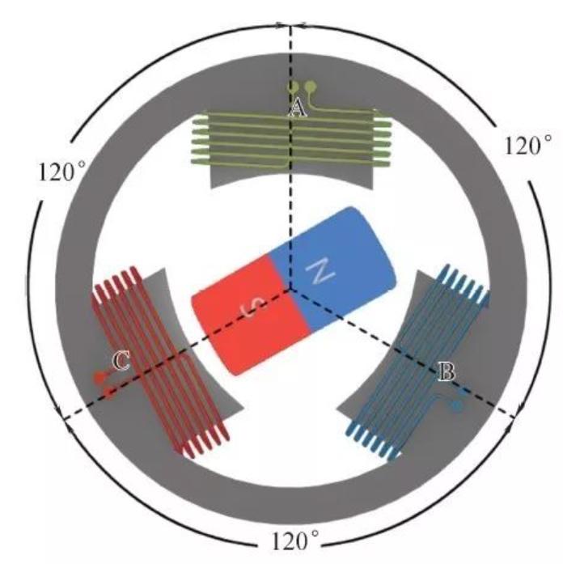

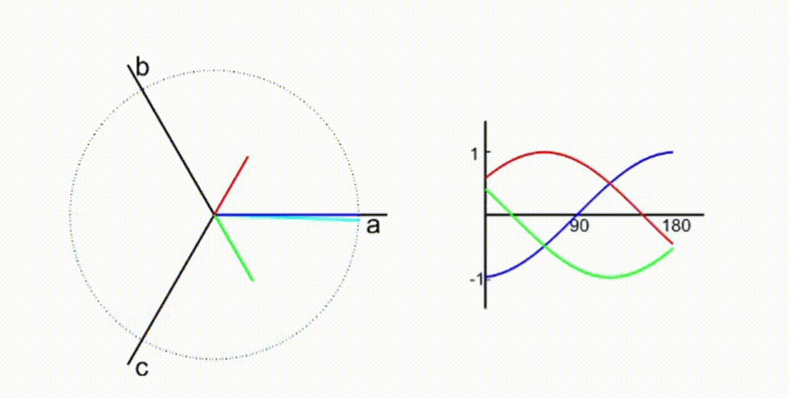

磁场领先转子磁链一个转矩角 → 产生切向力矩

三相交变电流通过组合，可以在定子中产生定向磁场，该磁场领先转子磁链一个转矩角，即可产生切向力矩，带动电机运动，产生一个不断旋转的矢量，即可让电机不停旋转。

1 三相电流采样

2 αβ 静止坐标系

3 dq 旋转坐标系

定子中的 ia、ib、ic 是相差 120° 的正弦量

Park：αβ → dq，让坐标轴以转子电角度 θe 同步旋转

Clarke：abc → αβ，把三相压缩成一个平面电流矢量 is

β

β

is

q

Iq

is

d

Park

Clarke

iβ

Id

α

α

iα

在同步坐标中，Id / Iq 变成近似直流量

ia

ib

ic

### Speaker Notes

首先 简单介绍下FOC基本原理。我们通过在定子中通入三相相差120°的交变电流，即可合成一矢量，该矢量会带动转子使电机重新定向。我们产生一个旋转的矢量，使其始终领先转子磁链一个转矩角，即可产生产生切向力矩带动电机不停旋转。然而根据内模原理，用普通的PI控制器无法跟踪正弦信号。所以这里引用Clarke 变换把它们合成为静止 αβ 平面中的一个电流矢量。Park 变换再利用编码器给出的转子电角度，让 d、q 坐标轴跟着转子一起旋转，于是原来不断变化的交流量变成近似不变的 Id 和 Iq。Id 对应磁链，Iq 对应转矩；控制器调节这两个分量，再通过逆 Park 和 SVPWM 控制三相桥，在定子里产生持续旋转的磁场。

## Slide 5

需求分析——从电机参数推导板级指标

关节电机

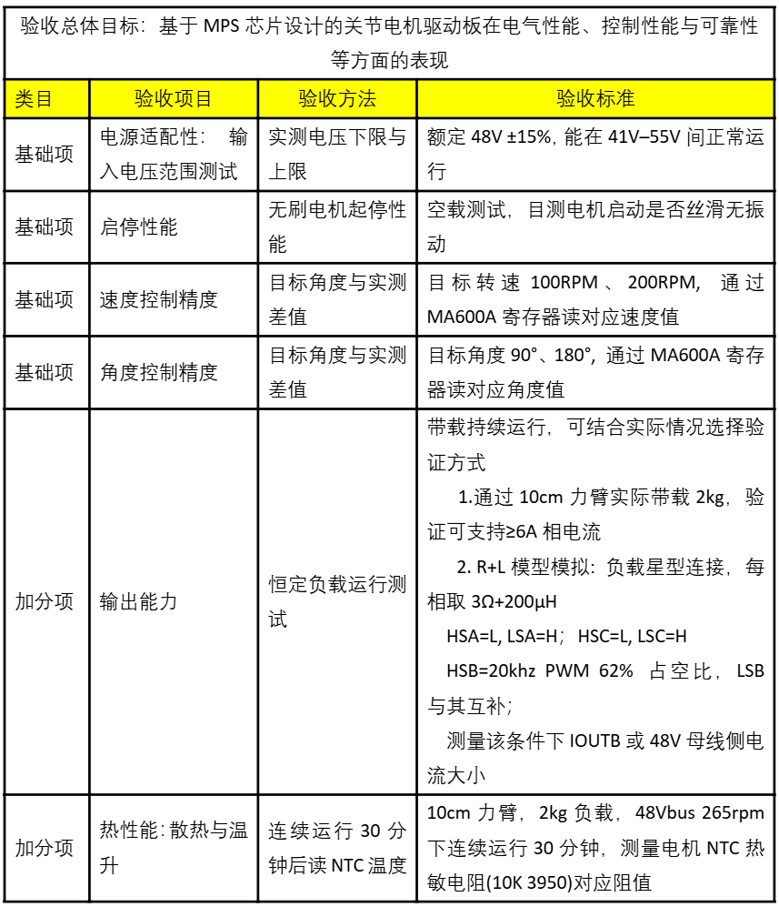

| 代表型号 / 项目 | 电压范围 | 功率 / 电流 | 控制与反馈 | 转速 / 控制 |
| --- | --- | --- | --- | --- |
| 达妙
DM-J8009-2EC | 24-48V | 额定功率约 209W | CAN/CANFD，磁编码器反馈 | 48V 下额定 200rpm，空载约 335rpm |
| 零差云控eRob80I V6 | 48V ±10% | 电机功率约 126W | EtherCAT / CANopen / Modbus，编码器反馈 | 输出峰值 25-60rpm |
| Unitree
B1-16 防水关节电机 | 36-64V | 未标额定功率 | 高速 485，1kHz 控制周期，编码器反馈 |   |
| MPS 关节电机 FOC 驱动板 | 48V ±10% | 额定功率约180W | CAN/CANFD，此编码器反馈 | 265rpm 空载 /160rpm满载 |

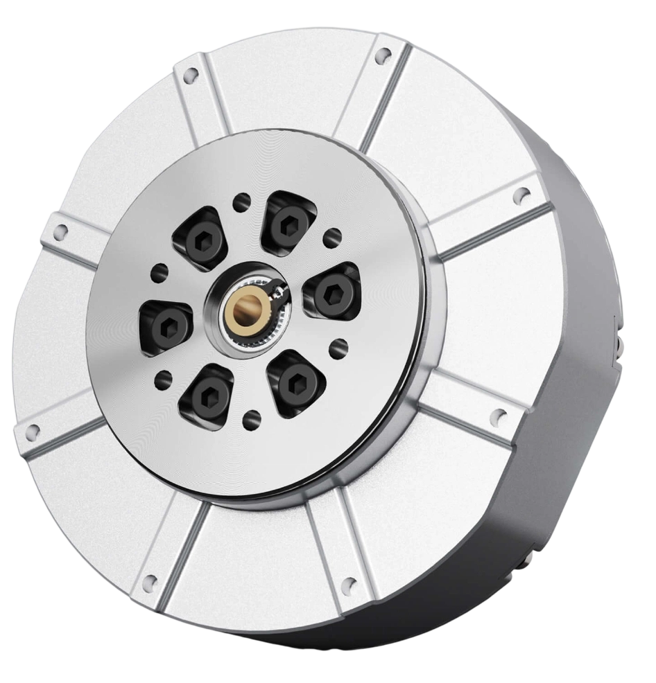

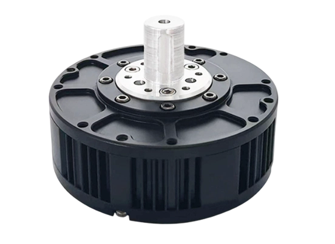

设计目标

- ● 输入电压：48V ±10%（41V～55V）
- ● 额定功率：180W
- ● 通信协议：CAN / CANFD
- ● 相电流： ≥3A RMS / ≥10A Peak
- ● 转速：空载 265rpm / 满载 160rpm
- ● 开关频率：20 kHz

### Speaker Notes

中间这张表是几款主流关节电机的横向对比，基本落在 48V 母线、100 到 200W 这个区间。本项目对齐这个定位——根据MPS-FOC的关节电机设计测试项和市面上常见的产品定义，推出我们的设计目标，使用CAN通信协议以适配主流标准.使用MPS方案，在满足市面上常见需求的情况下，达到更高功率密度

## Slide 6

芯片选型——辅助电源 MP4583、MP3632S

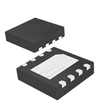

3.3V

VCC

5V

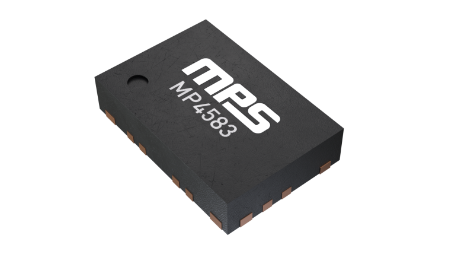

LDO MP20051DQ

48V

12V

48 Vbat

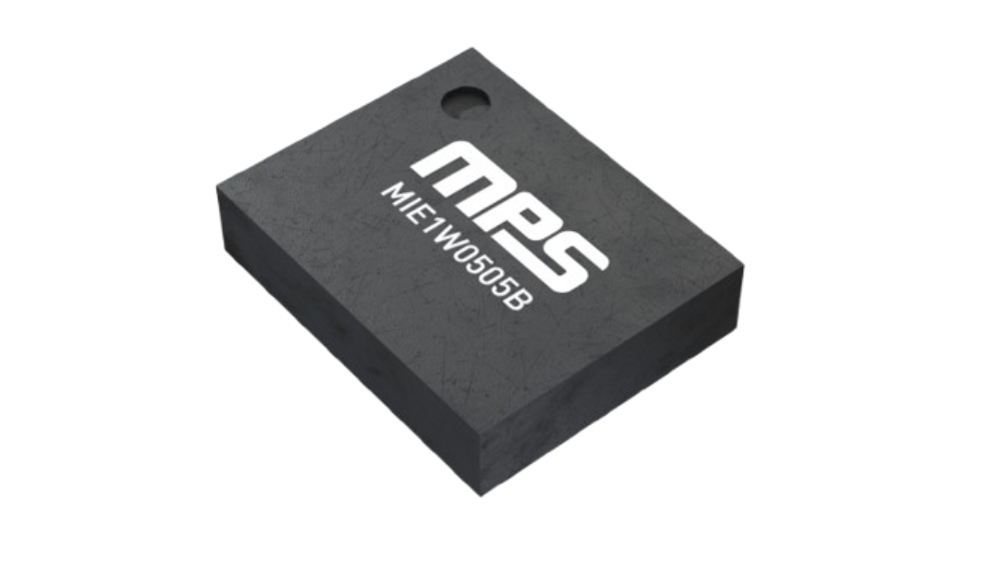

5V

ISO_5V

100V DC-DC MP4583

12V DC-DC MPM3632S

5V

- MIE1W0505
- 隔离电源

MP4583

MP3632S

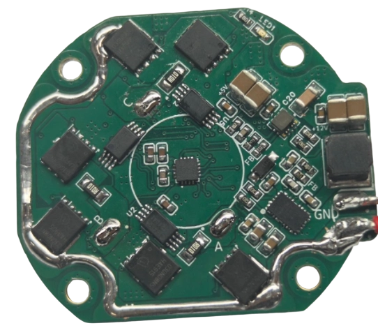

- ● 宽压输入 4.5V～100V，输出 3A，
- ● 静态功耗 8μA
- ● 集成 MOSFET，内置 FCCM 模式
- ● 内置OCP / SCP / OVP / OTP 四重保护
- ● 内置环路补偿，外围精简

- ● EC LGA-10 封装，仅 3×3×1.45mm,且集成了电感和部分电容
- ● 2.2MHz 高频 COT 控制，快速负载瞬态响应
- ● 集成 OCP（打嗝模式）/ OVP / 150°C 热关断三重保护
- ● 输出精度 ±0.5%，负载/线性调整率均 <0.5%
- ●强制 CCM 模式

### Speaker Notes

- 备注：这个图高亮一下这两个芯片 还没做呢
- 来看辅助电源选型：采用如图的三级降压的方案。除了MPS一惯的极致集成度外。还值得注意的是，MP4583拥有4.5V 到 100V 的超宽压输入，高达3A的带载能力，作为第一级辅助电源部分兼栅极驱动 MP6839供电，其集成的多种保护功能可以有效提高整体可靠性。
- 第二级MP3632S，最大的优势就是集成了电感和电容，整个模块只有 3×3mm。

## Slide 7

芯片选型——辅助电源 MIE1W0505、MP20051DQ

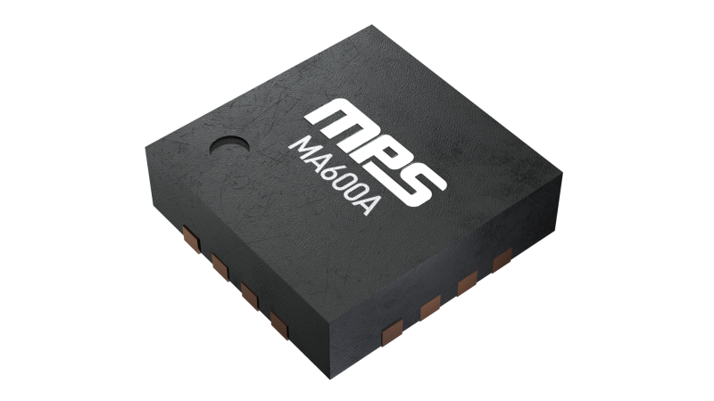

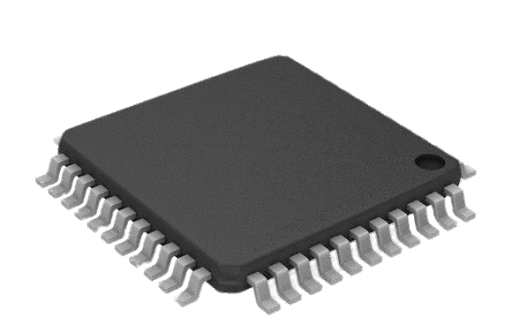

3.3V

5V

LDO MP20051DQ

- 位置传感器
- MA600A

5 Vdc

控制器

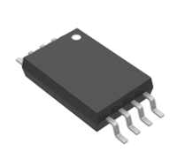

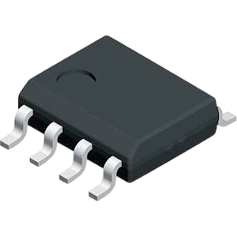

ISO_5V

5V

- MIE1W0505
- 隔离电源

CAN收发器

电流传感器

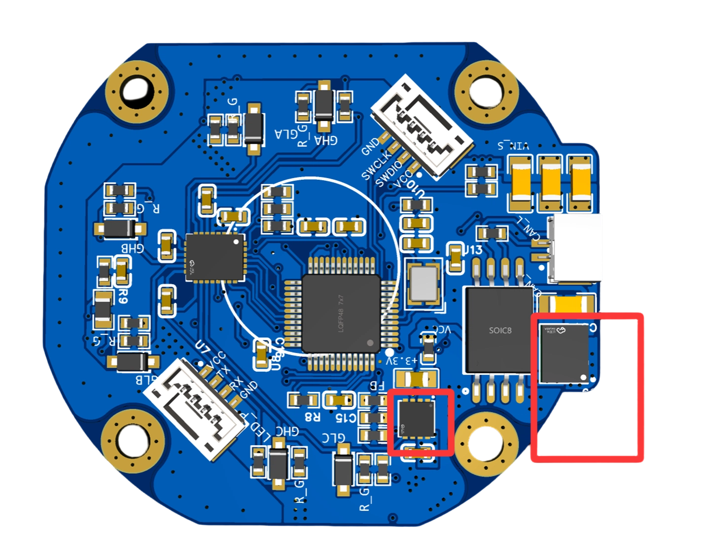

MIE1W0505

MP20051DQ

- ● 1A 负载下压差仅 140mV
- ● 典型静态电流 110μA
- ● 低噪声输出：13μVRMS
- ● QFN-8 3×3mm 封装，适合小尺寸控制板
- ● 用于生成干净的 3.3V VCC，供 MCU、编码器和采样电路使用

- ● 5V→5V 工况下可提供 ≥200mA 负载电流
- ● 负载调整率 0.5%，线性调整率 0.2%
- ● 内置连续短路保护 SCP 和过温保护 OTP
- ● 用于CAN通讯隔离，提高通讯质量与可靠性

### Speaker Notes

5V 电源出来以后，一路通过 MP20051DQ 生成 3.3V VCC，它在 1A 负载下压差只有 140mV，典型输出噪声 13μVRMS，可以最大限度排除因为电源纹波问题导致的电流采样和角度采样误差问题。另一路通过 MIE1W0505 生成隔离 5V，提供 200mA 以上负载电流，保证CAN通信稳定提高调试和联机运行时的可靠性。

## Slide 8

芯片选型——驱动电路 MP6539B

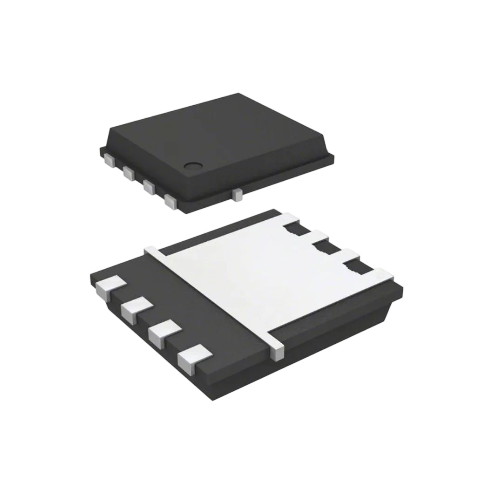

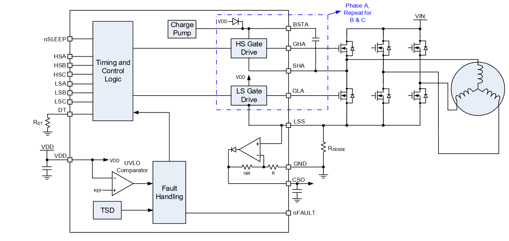

内置保护与运放

驱动能力

低功耗设计

死区设置

12V

12 Vdc

- ● 内置20 倍电流采样放大器，通过CSO输出模拟电压
- ● 实际应用场景可以进一步节省空间和成本
- ● VDD欠压保护UVLO，过温保护OTP

- ● 集成三路半桥NMOS驱动
- 内置 Charge Pump + Bootstrap，高边驱动可长时间维持
- ● 栅极驱动能力：0.8A 拉电流 / 1A 灌电流

● 支持 nSLEEP 低功耗休眠，休眠电流典型 2uA

● 支持可调死区：tDEAD(us)=0.044×RDT(kΩ)+0.1

### Speaker Notes

驱动电路使用是 MP6539B 三相 PMSM 预驱芯片。芯片支持 100V 母线应用与MP4583范围适配。其nSLEEP模式下仅2uA的静态电流可用作低功耗设计，内部Charge Pump 加 Bootstrap 结构，使得高边驱动可以长时间维持，栅极驱动能力优异，满足大部分场景需求。且内置运放与保护电路，节省成本提高可靠性。

## Slide 9

芯片选型——位置传感器 MA600A

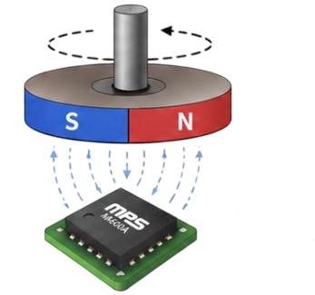

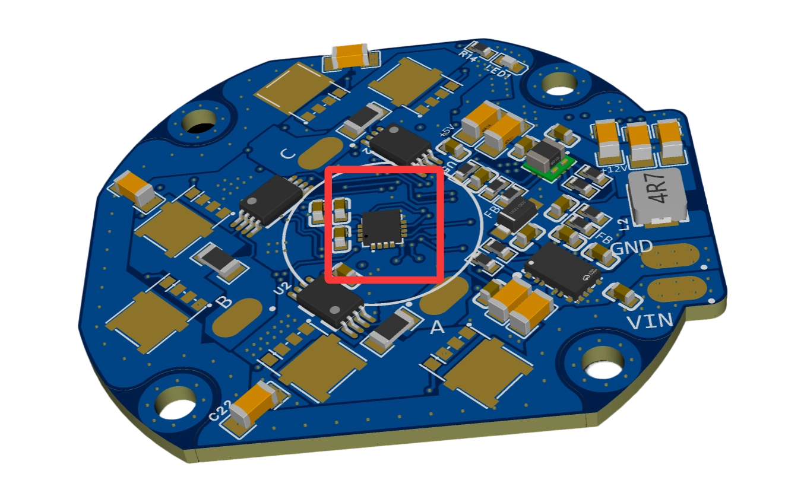

- SPI
- SSI
- ABZ
- UVW
- PWM

- 位置传感器
- MA600A

控制器

端轴式On-axis | 旁轴式Off-axis

| 型号 | 角度更新 / 延迟 | 带宽 | 精度与校准 |
| --- | --- | --- | --- |
| MA600A | 刷新率 800kHz；默认滤波下延迟补偿后约 ±0.5us 量级 | 默认 12kHz；最高 17kHz | INL <0.6°；32点校准后 <0.1° |
| AS5048A | 典型传播延迟约 100us | 采样约 11.25kHz | 典型精度 0.5° |
| TLE5012B | 更新 42.7us；无预测时延迟约 85-95us | 依赖滤波配置 | 典型电角度误差 0.6° 起 |
| MT6826S | 输出传播延迟约 2-10us | 未突出 10kHz 以上带宽 | 工厂校准约 0.5°，用户校准可到 0.1° |

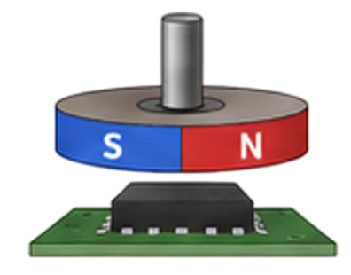

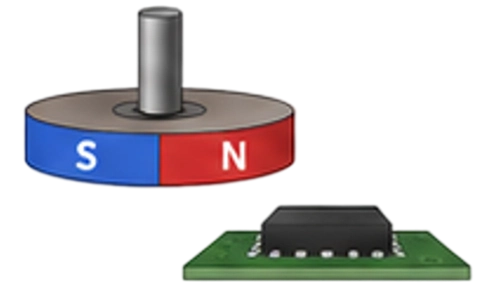

### Speaker Notes

- 相较于市面上其他的常用磁编码器，MA600A 在动态控制场景里更突出。它默认 12.5bit 配置下带宽有 12kHz，自带延迟补偿，补偿后延迟到达了夸张的1us内，按 3000rpm、7 对极电机粗算，MA600A的1us 级延迟对应的电角度滞后只有 0.1°量级；而同类产品 100us 级延迟会放大到十几度电角度。
- 此外 MA600A 支持端轴和旁轴两种安装方式，结构设计上灵活度更高。

## Slide 10

PCB Layout——板框与四层叠层

板框与工艺参数

L1 · Top

真实顶层铜皮与走线

● 外形尺寸：约 49.23 × 42.86 mm

L2 · GND

● 板层结构：4 层板

连续地平面与过孔

● 成品板厚：约 1.6 mm

L3 · Power

实际电源铺铜与分区

● 铜厚配置：外层约 1 oz

L4 · Bottom

● 布局规模：116 个器件，311 个过孔

真实底层布线与铜面

四层叠层职责

L1 · Top

器件布局、功率铜皮、栅极驱动与关键信号

L2 · GND

连续参考地平面，为采样、驱动和控制信号提供低阻回流路径

L3 · Power

电源分配与局部铜面，降低供电阻抗并辅助散热

L4 · Bottom

MCU、驱动与低速控制信号，配合过孔完成上下层互连

紧凑板框下，通过完整地平面和独立电源层控制回流路径与供电阻抗。

### Speaker Notes

- 完成器件选型和硬件计算后，接下来进入 PCB Layout。整板需要在约 49 × 43 毫米的空间内放下 48 V、180 W 功率驱动、三相电流采样、磁编码器和隔离 CAN 通信，因此布局重点是控制功率环路、噪声耦合和散热路径。
- 本项目采用四层板，成品厚度约 1.6 毫米，外层铜厚约 1 盎司，有条件的嘉人可以依照工业标准加厚到2盎司。
- 顶层承担器件、功率铜皮和关键走线，第二层保持连续地平面，第三层用于电源分配，底层布置控制器件和低速信号，这样可以在紧凑板框内获得稳定的回流路径。

## Slide 11

PCB Layout——功能分区

磁编码器中心区

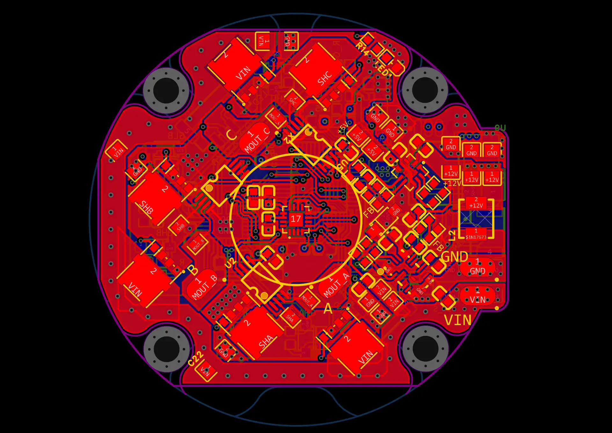

1

MA600A 对准电机轴心，周围限制高电流器件。

三相功率区

2

2

六颗 MOSFET 沿板边展开，缩短相线与散热路径。

驱动与控制区(背面)

3

5

MP6539B 靠近功率级，STM32G431 集中管理控制信号。

1

三相电流采样区

4

10 mΩ 分流电阻与 INA240 就近布置，控制采样环路。

4

辅助电源与隔离通信

5

3

DC-DC、隔离电源与 CAN 接口靠近板边，便于电源入口和外部总线连接。

分区原则：缩短大电流环路，隔离敏感采样与通信边界

### Speaker Notes

整板以 MA600A 和电机轴心为中心，板上可见明确圆圈丝印隔离高功率器件。六颗 MOSFET 沿外围展开，缩短三相功率输出和散热路径。MP6539B、STM32G431 和三相 INA240 位于控制与采样区域，辅助电源和隔离 CAN 靠近板边，方便连接输入电源和外部总线。

## Slide 12

PCB Layout——功率回路与栅极回路

主功率电流环路

按参考图复核本项目

● 半桥上下管相邻，开关节点铜皮短而宽

● 母线电容贴近功率级，回流不穿过控制地

半桥 MOSFET

48 V 输入

相线输出

分流电阻

高侧 + 低侧

● CBOOT / VDD 去耦贴近驱动器引脚

母线电容

U / V / W

10 mΩ

● Gate 与 Source 回流并行，减少栅极环路面积

● 高压功率走线与低压信号走线保持分离

环路面积越小，母线尖峰与开关噪声越容易控制

MPS 官方参考：MP6532 Demo Board

TI 官方参考：Bootstrap 元件布局

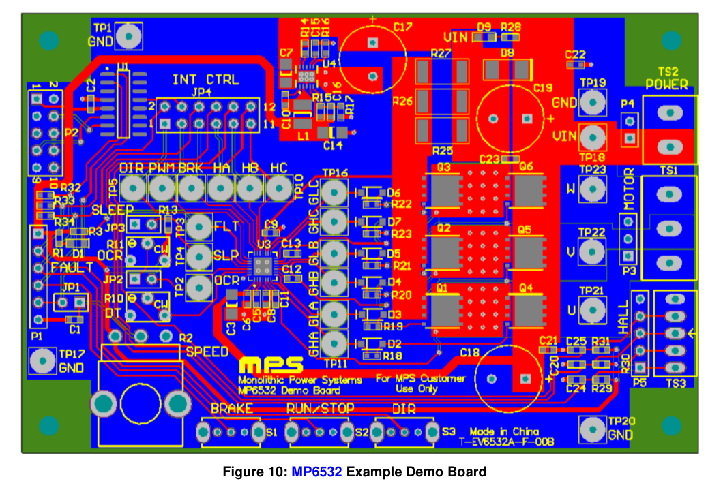

关注点

关注点

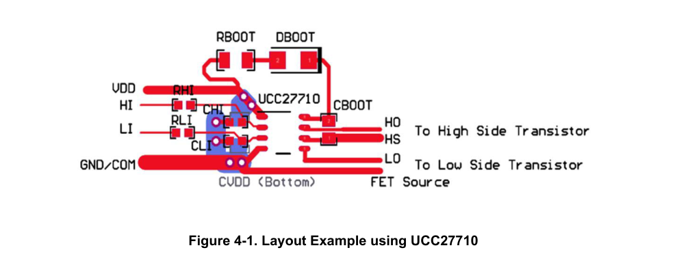

● 上下管连接极短

● CBOOT 紧贴 HO/HS

● 大电流路径宽铜皮

● CVDD 紧贴供电脚

● 去耦靠近驱动 IC

● 高峰值充电路径短

● 功率地避开信号地

● 高压/低压走线分离

来源：MPS AN111 Figure 10

### Speaker Notes

驱动回路的布局尤为重要，MPS 的布局参考重点体现上下管连接短、大电流路径宽铜皮、驱动去耦靠近芯片；同样的的 Bootstrap 布局示例强调 CBOOT 和 VDD 去耦要贴近驱动器，尽量缩小高峰值充电路径。MOSFET的Gate 与 Source 回流并行。

## Slide 13

PCB Layout——三相电流采样

三相分流电阻

INA240A1

输出 RC 滤波

STM32G431 ADC

R10 / R11 / R12 · 10 mΩ

增益 20 V/V

抑制开关尖峰与 ADC 混叠

同步采样并进入 FOC 电流环

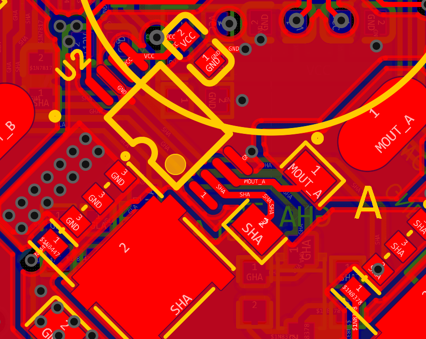

采样布局要点

- 电流采样 VS 与 GND 之间放置 0.1 μF 去耦电容，尽量贴近芯片电源引脚，回流路径短且直接接入参考地平面，滤除电源噪声。
- Kelvin采样连接，避免功率铜皮和焊盘压降进入采样结果。

● 分流电阻两端采用 Kelvin 四线取样

● IN+ / IN− 成对、等长并避开 SHx 与 Gate 节点

● INA240 紧靠分流电阻，缩小差分采样环路

● 0.1 μF 去耦电容紧贴电源引脚

● 输出滤波器靠近 ADC，走线参考连续地平面

采样比例：10 mΩ × 20 V/V = 0.2 V/A

### Speaker Notes

三相电流均通过 10 毫欧分流电阻和 INA240A1 采集，整体比例为 0.2 伏每安培。分流电阻两端采用 Kelvin 取样，差分线成对引到 INA240，并避开相位开关节点和栅极走线，输出经ADC处理后，进一步使用数字滤波处理。

## Slide 14

PCB Layout——编码器与隔离通信

MA600A 磁编码器布局

MIE1W0505 + ISO1042 隔离通信

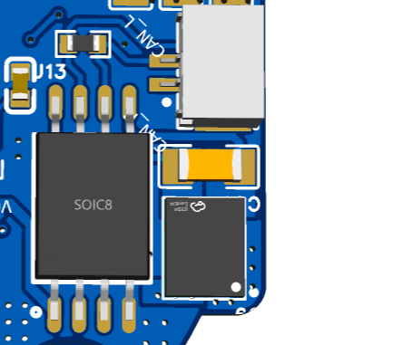

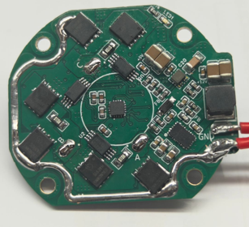

控制侧

总线侧

● 传感器中心与电机轴心对齐，减少偏心角误差

● 隔离电源与收发器靠近放置，缩短 ISO_5V 回路

● 大电流铜皮与开关节点远离传感器及磁钢区域

● 隔离边界上下层保持净空，禁止铜皮跨越

● 电容等磁性敏感器件距芯片中心至少 5 mm,丝印已标出

● CANH / CANL 成对布线并靠近接口与终端器件

● SPI 线短且参考完整地，可预留 200 Ω / 10 pF 滤波

● 控制地与总线地分区明确，降低外部共模干扰

保证角度反馈稳定，降低电流环与位置环抖动

将电机功率噪声限制在本地，保护控制与通信链路

### Speaker Notes

MA600A 位于电机轴心附近，高电流铜皮和开关节点需要远离传感器区域，周围电容与芯片中心保持至少 5 毫米距离。隔离通信部分由 MIE1W0505 和 ISO1042 构成，控制侧与总线侧保持清晰净空，CANH 和 CANL 靠近接口成对布线。

## Slide 15

PCB Layout——散热与设计检查

PCB Layout 设计检查

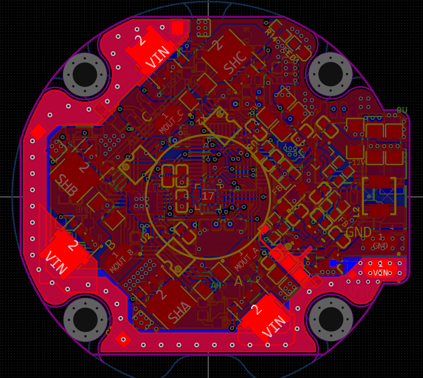

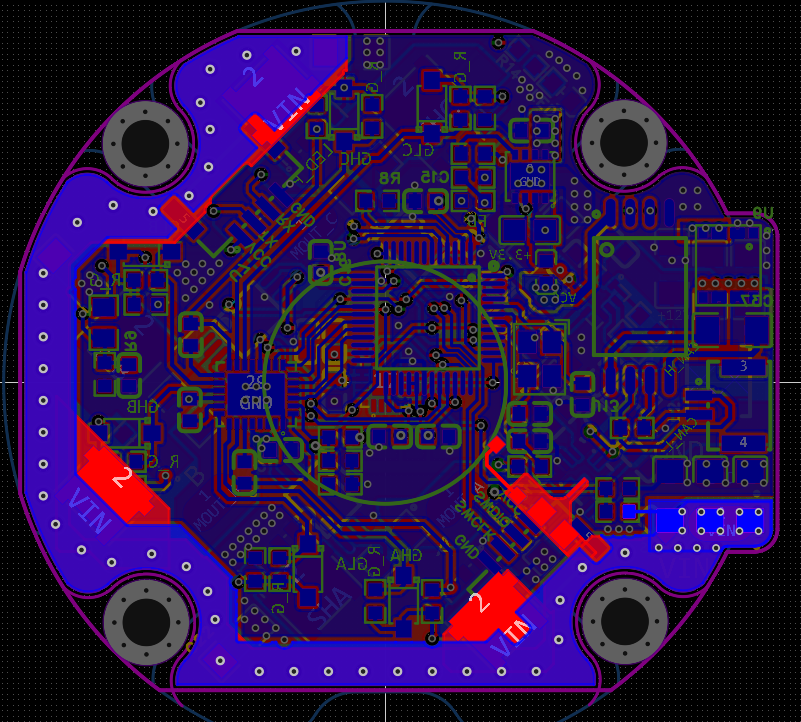

功率路径

✓

母线、半桥、相线与分流电阻环路短且宽

回流路径

✓

驱动、采样与控制信号均有连续地参考

热路径

✓

铜皮、导热过孔与结构散热形成连续通道

散热路径设计

敏感信号

✓

● MOSFET 与分流电阻采用大面积铜皮扩散热量

电流采样、编码器与 SPI 避开高 dv/dt 节点

● 上下层通过并联过孔导热，降低局部热点

隔离边界

✓

● 功率器件沿板边布置，便于接触外壳或结构件

隔离净空完整，控制地与总线地无铜皮跨接

● 温升测试后再确定铜厚、过孔数量与外壳导热方案

下一步：结合温升、母线尖峰和电流采样波形完成实板验证

### Speaker Notes

功率器件沿板边布置，通过大面积铜皮和并联过孔把热量扩散到上下层，并为后续与外壳导热预留条件。接下来做一个简单回顾，逐项检查功率路径、回流路径、散热路径、敏感信号和隔离边界，再通过温升、母线尖峰和电流采样波形完成实板验证。

## Slide 16

测试验证——辅助电源与宽压输入

实测场景 · 输入电压范围测试

验证结果

辅助电源测试

宽输入范围稳定运行

这个图换成用万用表测试几个点位的图

- ● 覆盖 48 V ±15% 工况
- ● 检查 12 V / 5 V / 3.3 V 电源轨

电源链路通过系统级运行验证

视频证据：Test1 Power Supply Input Voltage Range Test

### Speaker Notes

目前呢 对于一个已经焊接完成的硬件板子。我们已经可以进行一系列的板级测试。首先测试辅助电源各部分输出12V 5V 3.3V 隔离5V等是否正常。还可以覆盖一定范围的宽输入电压，测试辅助电源适配性能。

## Slide 17

测试验证——辅助电源与宽压输入

这一页要给出实际的视频，用万用表去测试各个点位 附带讲解的视频

## Slide 18

测试验证——三相电流采样链路

采样波形与 PWM 同步关系

记录指标

- ● 零电流 ADC 偏置与温漂
- ● 实测增益误差和线性度
- ● 三相通道一致性
- ● ADC 采样窗口裕量
- ● FOC 中 Ia + Ib + Ic 残差

相电流 / ADC 采样点

- 这里补一张 INA240 和 Vin Vout的输出以及 实际vofa换算波形对比，
- 最好用橙色点标注出采样点 更清晰

- 硬件比例：10 mΩ × 20 V/V = 0.2 V/A
- 验证顺序：零电流偏置 → 直流标定 → 三相一致性 → 动态带载

### Speaker Notes

电流采样验证先从零电流偏置开始，再用已知直流电流标定零点和增益，最后比较三相通道的一致性。动态运行时，ADC 采样点应该放在 PWM 稳定区间，避开开关沿和续流换相造成的尖峰。

## Slide 19

测试验证——双脉冲测试方法

测试拓扑

测试方法

将功率级从控制系统拆出来(排除板级其他影响)

1

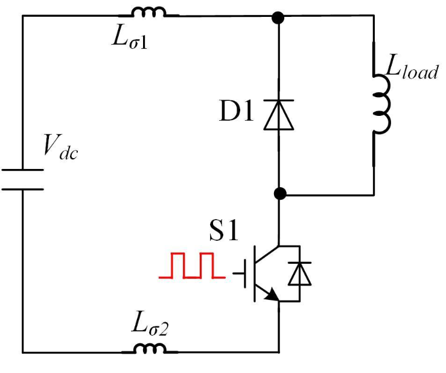

连接测试电路如图所示

2

发送双脉冲信号，示波器Trigger以MCU输出PWM波为触发

3

同步记录 VGS、VDS、ID 与母线电压

4

评估过冲、振铃、di/dt、dv/dt 与损耗

5

- 如图所示S1为双脉冲信号，
- Lload外接电感，
- D1为功率级上管MOSFET，这里仅作为二极管使用，
- L1和L2等效导线，
- Vdc为母线电压。

调整栅极电阻、吸收网络和布局回路

6

### Speaker Notes

对于一个新做好的电力电子板子来说，双脉冲测试不可或缺。把功率级从系统控制中单独拆出来。双脉冲测试方案如有边所示，双脉冲测试可以验证硬件系统可靠性，以及方便使用者调试驱动电阻，降低开关损耗。我们左图所示搭建测试电路，发出脉冲后，得到测试波形，放大最大，观察振铃现象。微调驱动电阻重复测试，知道振铃效果满意。

## Slide 20

同样这个场景

### Speaker Notes

经过上述设计，我们已经得到了一块儿可供使用，基础功能测试完成的
